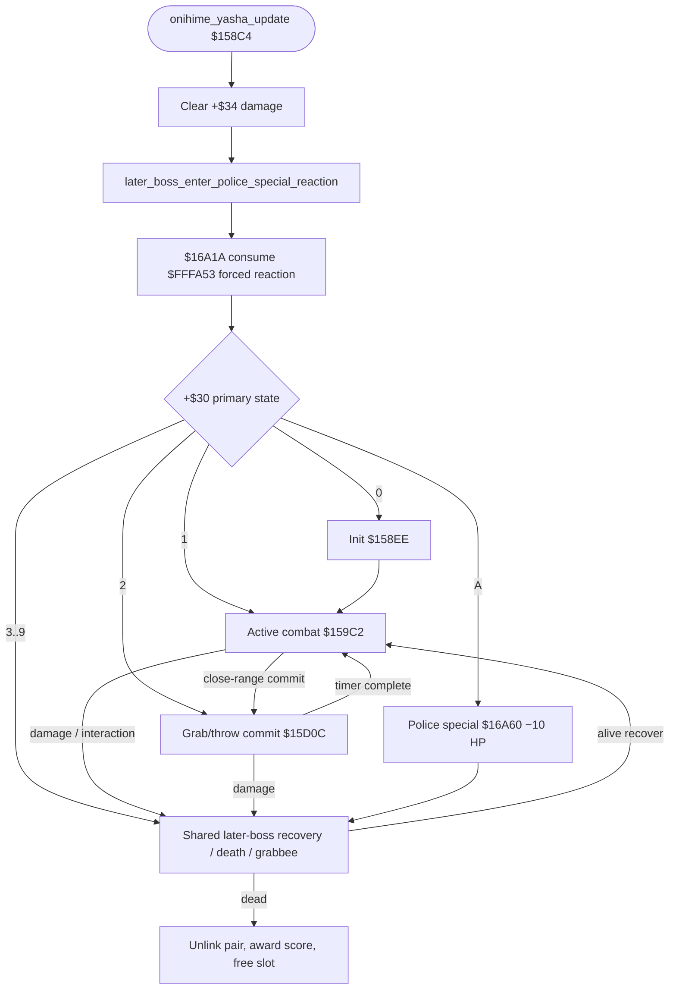
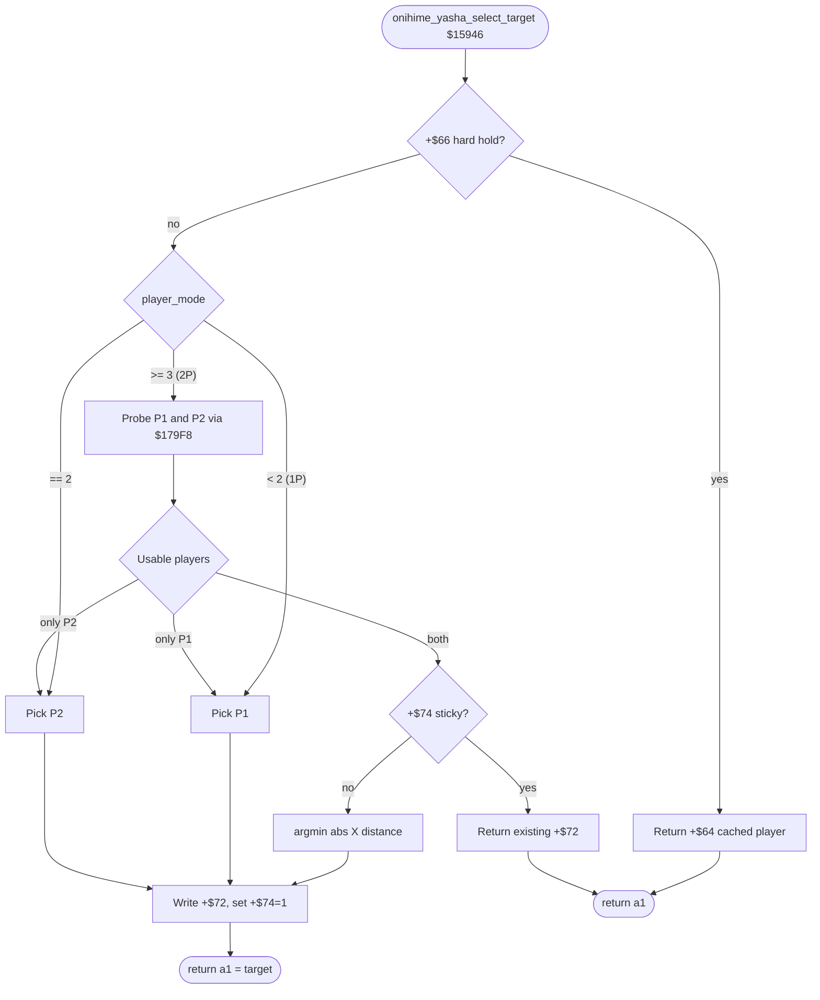
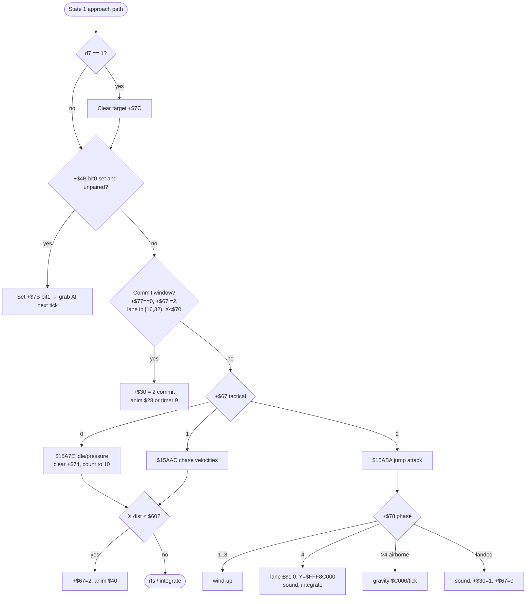
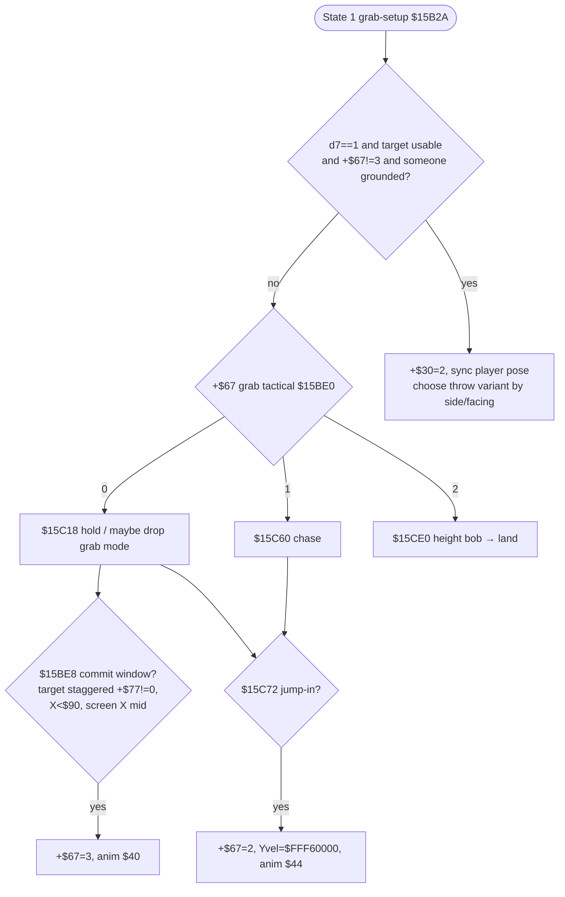
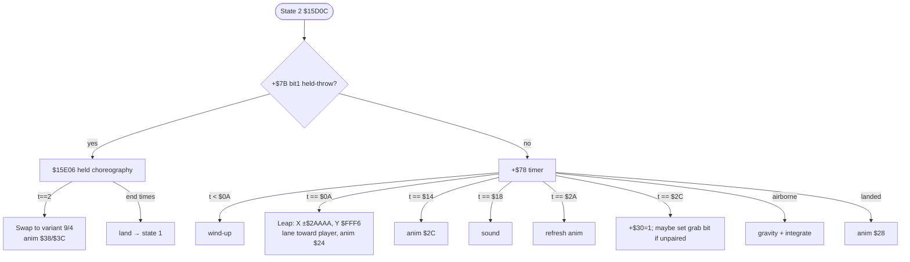
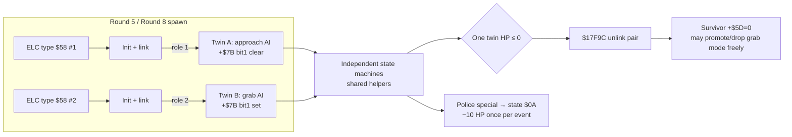

# Enemy and Boss Artificial Intelligence

## Scope, correction, and evidence

The first part of this document covers the ordinary-enemy engine centered on
`$00937A-$00A43D`; the second part covers boss architecture and every
round-specific encounter. A cross-check against decoded enemy-load-cue (ELC)
placement data establishes that object types `$55-$58` are **boss families**,
not ordinary enemies:

| Type | Boss family | Confirming rounds | Handler |
|---:|---|---|---:|
| `$55` | Souther | 2, 6, 8 | `$15E70 (souther_update)` |
| `$56` | Antonio | 1, 8 | `$16CE4 (antonio_update)` |
| `$57` | Bongo | 4, 6, 8 | `$174E0 (bongo_update)` |
| `$58` | Onihime/Yasha | 5, 8 | `$158C4 (onihime_yasha_update)` |
| `$30` | Abadede | 3, 8 | `$143D0 (abadede_update)` |

The ordinary-enemy part discusses those handlers only at the shared-infrastructure
boundary; the boss part later covers them directly. Earlier inference from their
sophisticated target selection was insufficient to classify them as ordinary
enemies; ELC placement is decisive.

The common ordinary-type dispatch range is the contiguous `$20-$2A`. `$9350 (is_nonordinary_enemy_type)` subtracts `$20` and accepts exactly eleven values, and the palette/metadata pass at `$810 (prepare_next_spawn_section)` applies the same bounds. Only `$20-$27` and `$2A` are complete combatants: `$28` is Jack's axe/torch projectile helper, while `$29` is the police-special enemy-sweep controller. Their zero health records and `$29`'s null animation pointer are therefore intentional. The ordinary subsystem is more data-driven than the later boss handlers: type and variant select health, damage, palette, animation, and behavior tables around `$026FCE-$027032`.

## Ordinary-enemy lifecycle

```text
spawn type $20-$2A
    -> wait until active/on screen ($937A / $A59C)
    -> initialize type+variant tables ($938C)
    -> choose active player target ($96EC)
    -> primary state $0100: normal behavior
    -> sufficient damage may enter $0300 knockdown/airborne; grabs use $0500
    -> blocked movement/contact may enter $0700
    -> health/death enters $0600
    -> remove object, release palette/active-enemy accounting
```

`$937A (ordinary_enemy_activate)` is the activation entry. Once the object is eligible, `$938C (ordinary_enemy_init_type_data)` derives `type_index=type-$20`, initializes combat/animation metadata, selects a target, and enters the normal state.

Primary state is a **word** at object offset `$30`, normally encoded in `$0100` increments. This differs from the byte-sized state conventions in several boss families.

## Object layout used by ordinary enemies

Objects are 128 bytes in the table beginning at `$FFB900 (object_table)`.

| Offset | Width | Meaning | Evidence |
|---:|---:|---|---|
| `$00` | B | Type `$20-$2A` | `$9350 (is_nonordinary_enemy_type)`, `$938C (ordinary_enemy_init_type_data)` |
| `$01` | B | Visibility, collision and airborne flags | hit/death paths |
| `$04` | L | Animation-set pointer | selected from `$27032 (ordinary_enemy_animation_set_pointer_table)` |
| `$08` | W | Animation/action index | `$969E/$96C0` |
| `$09` | B | Facing flags; bit 1 is left/right | `$96C0`, `$9E4C` |
| `$10/$14/$18` | L each | X, lane/depth, and vertical position | movement helpers |
| `$1C/$20/$24` | L each | X, lane, and vertical velocity | `$973E`, `$9F96 (ordinary_enemy_advance_x_bounded)`, `$A00E (ordinary_enemy_advance_lane_bounded)` |
| `$30` | W | Primary state (`$0100`, `$0300`...) | reaction paths |
| `$31` | B | Fine-grained reaction/physics flags | `$991A-$9D16` |
| `$32` | W | Health/energy | `$93CE (ordinary_enemy_init_combat_values)`, `$9BC6`, `$A13A` |
| `$33` | B | Low byte of current health word `$32`; initialized by type/variant and mirrored at `$38` | `$93CE (ordinary_enemy_init_combat_values)`, word damage subtraction at `$9BC6/$A13A` |
| `$34` | B | Contact/attack damage | `$93CE (ordinary_enemy_init_combat_values)`, damage consumers |
| `$37` | B | Hit/throw/death flags | shared collision paths |
| `$39` | B | Score/palette/accounting selector | `$93B4`, `$9E26 (ordinary_enemy_award_score)` |
| `$3E` | W | Current collision/attacker object pointer | `$969E`, `$9BC6` |
| `$40-$41` | B/B | Spawn/variant metadata | `$945A`, visibility gates |
| `$42` | W | Current target player pointer | `$96EC (ordinary_enemy_select_target)` |
| `$48-$4B` | B each | status, damage/reaction and substate scratch | reaction dispatchers |
| `$50-$51` | B/B | General action timer/substate scratch | many states |
| `$60/$62` | W/W | Desired X/lane point for scripted approach | `$9604-$9682` |
| `$66/$68` | W/W | Type-derived approach offsets | `$945A` |

Several offsets are polymorphic by state and type; the table lists only uses demonstrated across the common subsystem.

## Type and variant data

`$938C (ordinary_enemy_init_type_data)` performs four data-driven steps:

1. `$00945A` splits spawn byte `$41` into two nibbles and maps each through `$9484`, producing signed/unsigned approach offsets at `$68/$66`.
2. `$93CE (ordinary_enemy_init_combat_values)` indexes six-byte records at `$26FCE (ordinary_enemy_combat_value_table)` by `type_index*6 + variant`. Bytes 0-2 are initial health for variants 0-2; bytes 3-5 are their attack damage. It writes health to the low byte `$33` of word `$32`, mirrors it at `$38`, and writes damage to `$34`. On highest difficulty health and damage both receive `+4`.
3. `$0093B4` indexes `$27010 (ordinary_enemy_accounting_selector_table)` to choose `$39`, used by score/palette accounting.
4. `$009406` selects palette/tile base, while `$27032[type_index]` supplies the animation/behavior resource pointer.

Thus archetype differences are not eleven completely separate top-level functions. The shared state machinery is parameterized by type records, animation command streams, approach offsets, attack damage, palette and per-animation callbacks.

| Type range | Classification | Proven differentiation |
|---|---|---|
| `$20-$27`, `$2A` | Normal ordinary-enemy entries | Nine complete type records; type/variant health, damage, palette and animation-set pointer |
| `$28/$29` | Dedicated helper slots inside the accepted range | `$28` is Jack's thrown projectile; `$29` is the police-special ordinary-enemy sweep controller |
| `$30` | Abadede boss | Separate byte-state handler `$143D0 (abadede_update)` |
| `$55-$58` | Souther/Antonio/Bongo/Onihime-Yasha bosses | Separate boss-family handlers and target selectors |

The ROM reduces the eleven internal types to five visual families through the
byte table at `$A4E (ordinary_enemy_art_family_table)`. Each family selects one Nemesis stream; three art-cue
IDs then place that same stream in one of three resident VRAM slots. Rendering
those five streams with `tools/decompress.py` and visually classifying the
result gives this mapping:

| Internal type(s) | Art-family byte | Nemesis stream | Visual identity | Distinguishing behaviour |
|---|---:|---:|---|---|
| `$20-$23` | `$01` | `$20172 (garcia_nemesis_art)` | Garcia | Most common basic enemy |
| `$24` | `$02` | `$21708 (signal_nemesis_art)` | Signal | Sliding attacks; gets behind and throws the player |
| `$25`, `$2A` | `$03` | `$22BFE (haku_ro_nemesis_art)` | Haku-Ro | Highly mobile ninja |
| `$26` | `$04` | `$245E0 (nora_nemesis_art)` | Nora | Whip attacks; some variants feign injury before resuming combat |
| `$27`, helper `$28` | `$05` (`$85` for `$28`) | `$258F8 (jack_nemesis_art)` | Jack plus thrown axe/torch art | Jack juggles the projectile and may stop and throw it |

This is a **visual-family mapping**, not proof that every internal ID in a
shared row behaves identically. The type tables make the differences explicit:

The dispatcher labels follow that same distinction. `$D606 (garcia_type20_dispatcher)`,
`$D99A (garcia_type21_dispatcher)`, `$DD78 (garcia_type22_32_dispatcher)`, and
`$E326 (garcia_type23_dispatcher)` are named as Garcia-family dispatchers because
their object types select the Garcia art and animation resources; the retained
type suffix records that the four internal variants still have separate state
tables and combat values. Likewise `$E4D2 (signal_type24_dispatcher)`,
`$E8F0 (haku_ro_type25_dispatcher)`, `$F038 (nora_type26_dispatcher)`,
`$F27E (jack_type27_dispatcher)`, `$F7D0 (haku_ro_type2a_dispatcher)`, and
the Jack projectile dispatcher at ROM entry `0000FC14` name the confirmed visual identities
without collapsing the remaining behavioural differences.

| Type | Identity | Animation set | Variant health bytes | Variant damage bytes |
|---:|---|---:|---|---|
| `$20` | Garcia | `$1FC70 (garcia_animation_set)` | `$06,$09,$0B` | `$08,$08,$08` |
| `$21` | Garcia | `$1FC70 (garcia_animation_set)` | `$04,$07,$09` | `$04,$08,$08` |
| `$22` | Garcia | `$1FC70 (garcia_animation_set)` | `$04,$07,$09` | `$04,$08,$08` |
| `$23` | Garcia | `$1FC70 (garcia_animation_set)` | `$06,$09,$0B` | `$0C,$0C,$0C` |
| `$24` | Signal | `$22948 (signal_animation_set)` | `$04,$07,$09` | `$08,$08,$0C` |
| `$25` | Haku-Ro | `$2402C (haku_ro_animation_set)` | `$04,$07,$09` | `$0C,$0C,$10` |
| `$26` | Nora | `$242F8 (nora_animation_set)` | `$07,$0B,$0E` | `$08,$08,$08` |
| `$27` | Jack | `$2556C (jack_animation_set)` | `$09,$0E,$11` | `$0C,$10,$14` |
| `$28` | Jack axe/torch projectile helper | `$2556C (jack_animation_set)` | `$00,$00,$00` | `$0C,$10,$14` |
| `$29` | Police-special sweep controller | null | `$00,$00,$00` | `$00,$00,$00` |
| `$2A` | Haku-Ro | `$2402C (haku_ro_animation_set)` | `$07,$0B,$0E` | `$0C,$0C,$10` |

The exact duplicate animation pointers prove that `$20-$23` share the Garcia
animation resource, `$25/$2A` share Haku-Ro, and Jack's type `$27` plus its
type-`$28` projectile share the Jack resource. `$FC1C` creates type `$28` from
Jack, copies its target and damage, and the `$FC66-$FE3E` path launches,
collides, returns, or removes the axe/torch helper. Type `$29` is created by
`$9566 (prepare_ordinary_enemies_for_police_special)` and dispatches directly
to `$100B6 (police_special_enemy_sweep_update)`, so it needs neither the normal
animation pointer nor combat values. Neither helper belongs in regular ELC
waves.

The high bit on types `$28/$29` has engine meaning: `$810
(prepare_next_spawn_section)` excludes those entries from the ordinary
palette-family count, while `$9406` strips the bit when selecting the art
family and uses its fixed residency path.

Direct Nemesis decoding of all eight ELC streams gives a useful constraint on
that future mapping. The regular wave blocks contain these ordinary type IDs
after stripping the two-player qualifier bit:

| Round | Ordinary types present in regular blocks |
|---:|---|
| 1 | `$20,$21,$22,$23,$24,$25,$26` |
| 2 | `$20,$21,$22,$23,$24,$25,$26,$27` |
| 3 | `$20,$21,$22,$23,$24,$25,$26,$2A` |
| 4 | `$20,$21,$22,$23,$24,$25,$26,$27` |
| 5 | `$20,$21,$22,$23,$24,$25,$26,$27,$2A` |
| 6 | `$20,$21,$22,$23,$24,$25,$26,$27` |
| 7 | `$20,$21,$22,$23,$24,$25,$26` |
| 8 | `$20,$21,$22,$23,$24,$25,$26,$27,$2A` |

Types `$28/$29` do not occur in any regular ELC wave block in this ROM;
`$2A` occurs only in Rounds 3, 5, and 8. This is a ROM-distribution fact, not a
retail-name assignment, and it avoids treating all eleven table slots as
equally used by the level scripts.

## Target selection

`$96EC (ordinary_enemy_select_target)` is the common ordinary-enemy selector. It writes the player object pointer to `$42(a0)`:

- no active player: enter state `$0400` and set the relevant state flag;
- 1P: select the active player's object;
- 2P: compare absolute X distance and select the closer player.

```text
function ordinary_enemy_select_target(enemy):
    if no players active:
        enemy.state = $0400
        return none
    if only P1 active: target = P1
    else if only P2 active: target = P2
    else target = argmin(abs(P1.x-enemy.x), abs(P2.x-enemy.x))
    enemy.target_ptr = target
```

There is no global threat table. Targeting is nearest-X and can be recalculated by behavior states. Boss selectors at `$129F8`, `$15946 (onihime_yasha_select_target)`, `$16294 (souther_select_target)`, `$16D40 (antonio_select_target)`, and `$1753A (bongo_select_target)` are separate. Souther/Antonio/Bongo often add pair-role, facing, or lane biases inside the selector itself; Onihime/Yasha's selector is availability + sticky nearest-X, while pair role instead seeds the grab-vs-approach path (see the twins section).

## Navigation and spacing

`$009604-$009682` moves toward desired X/lane coordinates stored at `$60/$62`. `$009648/$009654` derive those coordinates from the target and type-derived offsets `$66/$68`, reflecting offsets at lane boundaries. `$982C (ordinary_enemy_vector_to_velocity)` converts a vector to fixed-point X/lane velocity using the direction table at `$2705E`; on Easy, high speed values are reduced.

`$98E8 (ordinary_enemy_distance_metric)` computes an inexpensive distance metric:

```text
major = max(abs(dx), abs(dlane))
minor = min(abs(dx), abs(dlane))
distance ~= 3/8 * major + minor
```

Movement is constrained by collision and arena helpers:

- `$9F96 (ordinary_enemy_advance_x_bounded)` advances X but rejects stage bounds (with special bounds for rounds 7/8);
- `$A00E (ordinary_enemy_advance_lane_bounded)` advances lane and constrains it normally to `$02-$70`, with a wider round-7 special case;
- `$9E68 (ordinary_enemy_move_with_collision)` probes ground/obstacles, resolves small side steps and transitions to state `$0700` when blocked;
- `$009F22/$009F56/$009F6A/$009FE6` perform forward/side obstruction checks before allowing movement.

This is steering plus collision probes, not graph search. Enemies approach a target-relative point, stop or sidestep when probes fail, and let animation/state callbacks decide when to attack or retreat.

## Attack decisions, difficulty, and randomness

The common engine divides responsibility:

- distance/target helpers decide whether the enemy can reach its desired point;
- animation command streams and type-selected callbacks decide exact attack phases;
- contact routine `$AA22` reports interaction kind in `d7`;
- reaction dispatch uses flags/substate at `$31/$4A/$4B/$50`.

Randomness is explicit rather than ambient. `$0104D8` is used in reaction/landing paths, for example choosing a short recovery animation delay (`(rng & 3)*2+3` at `$9A32`). The code observed here does not support a claim that every attack is probability-driven.

Proven difficulty effects are:

- spawn filtering by low two bits of ELC metadata in `$784 (process_timed_spawn_records)`;
- `$93CE (ordinary_enemy_init_combat_values)` adds four to initial health `$33` and attack damage `$34` on the highest difficulty;
- `$982C (ordinary_enemy_vector_to_velocity)` reduces large movement speed on Easy;
- type/variant tables may already encode different baseline health/damage.

## Garcia-family state tables and confirmed strike boxes

Types `$20`-`$23` each own a distinct byte-state dispatch table, reached from
their trampoline (`$D606 (garcia_type20_dispatcher)`/`$D99A (garcia_type21_dispatcher)`/`$DD78 (garcia_type22_32_dispatcher)`/`$E326 (garcia_type23_dispatcher)`) via the shared indexer
`$B186 (dispatch_object_primary_state_table)` (`d0 = byte at +$30`; jumps through `table[d0*2]`). Reading the four
tables from ROM gives, notably, that **types `$21` and `$22` reuse identical
handler addresses for states `$02`-`$07`** (`$9B36 (ordinary_enemy_hit_reaction_dispatch)`/`$991A (ordinary_enemy_begin_knockdown)`/`$A43E`/`$A04A`/
`$9D16`/`$DBCC`) and **share the same attacking-state handler at `$E190`**
for their own state `$0A` — confirming enemy-ai.md's existing claim that the
four types are "separate state tables" built from a common toolkit, not
independent implementations.

A small number of state handlers across the whole ROM (six, found by
searching every `jsr $00AD04` call site) perform a **direct, explicit**
collision test against the current target's cached body box, independent of
the generic per-frame `$AAA0`/`$AB24` pipeline every object goes through
regardless of state:

```text
$00AD04: a1 = object+$42 (target pointer)
         if target's cached body box (+$70) is non-degenerate:
             jmp $00AB24 with d1 = box id  ; same shape-table rebuild as $AB24
```

`d1` is loaded immediately before each call, selecting the box id by facing
(`btst #$01,+$9(a0)`, even = right-facing id, odd = left-facing mirror). This
gives **positive, address-level confirmation** — not the geometric
"out-reaches its own body box" heuristic `attack_ranges.py` otherwise relies
on — that a specific shape id is a genuine strike, for:

| Type(s) | State | Handler | Box id (R/L) | Shape (facing right) |
| --- | --- | --- | --- | --- |
| `$20` | `$09` | `$D856` | `$14`/`$15` | forward `+32..+56` |
| `$21`, `$22` (shared) | `$0A` | `$E190` (+ `$E0EC` sub-check) | `$12`/`$13` then `$3E`/`$3F` | forward `0..+40`, then `+16..+51` |
| `$26` (Nora) | `$08` | `$F1B0 (nora_type26_whip_engage_state)` | `$22`/`$23` | forward `+32..+80` |

The Nora row independently confirms the dead-zone reach `attack_ranges.py`
already extracted purely geometrically (see graphics-engine.md §8.3): this
is the same shape id reached by two unrelated methods.

**This table is not exhaustive.** Absence from it does not mean a shape is
not a real strike — most ordinary-enemy attacks are never gated by this
manual `$AD04` shortcut at all and rely solely on the generic per-frame
pipeline (whatever `+$02`/`+$03` the currently displayed animation frame
sets, tested every object, every frame, by `$AAA0`). In particular:

- type `$20`'s **other** state, `$0A` (`$D8EC`, also documented as
  `ATTACKING` from live testing), does not call `$AD04` at all — it toggles
  a linked-object pointer at `+$6A` and plays a sound, with no direct
  collision test in its own body; whatever it does hit is decided entirely
  by the generic pipeline against its animation's own `+$02`;
- type `$23`'s attacking state `$09` (`$E47E`) likewise never calls `$AD04`;
- `$1FC70 (garcia_animation_set)` is **shared by all four types**, so it
  contains attack-capable shapes (at minimum `$14`, `$12`, `$3E`, plus an
  unconfirmed `$18` at animation index 24) that do not all belong to every
  type using the set. `attack_ranges.py`'s per-shape extraction walks the
  whole shared set and cannot yet tell, from geometry alone, which of a
  shared set's shapes belong to which sharing type — the confirmed rows
  above are the only type-specific attribution with hard evidence so far.

## Signal's slide is velocity, not a hitbox

Signal (`$24`) is documented above as "Sliding attacks; gets behind and
throws the player" (visual-family table). Its own animation set (`$22948
(signal_animation_set)`) has only 7 mirrored animation pairs, and an
exhaustive walk of every shape any of them select finds nothing resembling
a long reach: the largest is `$1D`, forward `-24..+24`. Every shape in the
set is close-range.

The slide is real, but it is not expressed as an attack box at all. Signal's
own state table (`$E4DA`, reached from `$E4D2
(signal_type24_dispatcher)`) puts state `$0A` at handler `$E54E`, which
writes the ordinary-enemy velocity fields directly:

```text
$00E568  +$1C(a0) = ±$00028000   ; 16.16 fixed point = ±2.5 px/frame (X)
$00E57E  +$20(a0) = ±$00020000   ; ±2.0 px/frame (lane)
```

sign chosen by comparing the enemy's own position against the target's
(`cmp.w +$10(a0),d0` / `cmp.w +$14(a0),d1` against values staged earlier in
the same state) — i.e. "move toward the target," not a fixed vector. This
state never calls `$AD04` and its own animation carries no long-reach
shape; the hit, when it lands, is decided by the generic per-frame
`$AAA0`/`$AB24` pipeline testing Signal's *ordinary* body box once the
slide's own velocity has carried it into the player, not by an extended
attack box being tested from a stationary origin.

This means Signal's slide is architecturally a **closing** attack, the same
class `ClosingEnemy` (`inference.check_for_closing_enemies`) already exists
to flag from `grunt_vel_x`/`grunt_vel_y`, not a **reach** attack the way
`AttackRange` models every other confirmed strike in this document. No
static per-shape geometry extraction can represent it: the danger is the
approach itself, not a box drawn around Signal's current position.

## Nora's own primary-state table, and a second scripted lunge

Nora's whip (`$26`, confirmed-strike table above) is not the whole picture
of how she closes distance. Her primary-state dispatch table — a plain word
array at `$10362`, referenced by `$F038 (nora_type26_dispatcher)` — was
dumped directly from ROM (entry *N* is state byte *N*, the alignment
`$991A (ordinary_enemy_begin_knockdown)` at entry 3 already confirms for
every ordinary type) and traced instruction-by-instruction, since none of
her own states beyond the generic `$00`-`$07` block had previously been
documented at all:

State `$00` (a short-lived activation gate) is omitted from the table
below: it is not a state worth its own row.

| State | Handler | Role |
| --- | --- | --- |
| `$01` | `$F0E6 (nora_type26_state1_target_select)` | Re-select target, branch to next state |
| `$02` | `$F062 (nora_type26_hit_reaction_state)` | Her own override of the shared hit-reaction entry — see below |
| `$03`-`$07` | generic (`$991A (ordinary_enemy_begin_knockdown)`/`$A43E`/`$A04A`/`$9D16`/`$DBCC`) | Knockdown/scripted/grabbed/death/blocked, identical to every checked ordinary type |
| `$08` | `$F1B0 (nora_type26_whip_engage_state)` | Whip engage-and-swing (below) |
| `$09` | `$F0FC (nora_type26_chase_approach_state)` | Ordinary chase toward an approach point |
| `$0A` | `$DDE6` | The same "damaging special" entry already documented above for Garcia `$22` state `$13` |
| `$0B`, `$0F` | `$9B36 (ordinary_enemy_hit_reaction_dispatch)` | Reached a second way — see below |
| `$0C` | `$F078 (nora_type26_feign_injury_recovery)` | "Feign injury" recovery (below) |
| `$10` | `$F2AC (ordinary_enemy_knockdown_trigger_state)` | Shared with Jack `$27` state `$03` |
| `$12` | `$F2BC (ordinary_enemy_blocked_delegate_state)` | Shared with Jack `$27` state `$07` |
| `$13`-`$15` | `$F5F2 (ordinary_enemy_special_lunge_lane_setup)`/`$F64A (ordinary_enemy_special_lunge_distance_gate)`/`$F6BC (ordinary_enemy_special_lunge)` (`ordinary_enemy_special_lunge_*`) | A second, ROM-shared scripted lunge — see below |

### The whip is a live position test, not just a static box

`$F1B0 (nora_type26_whip_engage_state)` does not wait for a fixed windup
before deciding whether the whip lands. Every tick it has not yet committed
(object `+$31` bit 1 clear), it runs the manual `$AD04` shortcut — the same
direct-collision test already confirmed above for Garcia `$20`/`$21`/`$22`
— with shape `$22`/`$23` against the target's **current** position. A miss
walks the target toward a `$38` (56px) approach offset — comfortably inside
the whip's own `+32..+80` reach — and retries next tick; a hit commits
(`+$31` bit 1 set), plays attack animation index `$14`, and on completion
may loop up to three consecutive swings (a counter at `+$50`, seeded 3)
before giving up and returning to state `$01`. Because the position test
re-runs every tick during the approach, a target that closes distance
quickly enough can be tested as "in range" and committed against
immediately once it crosses `+32`, with none of the extra windup a fixed
attack-animation timeline might suggest — this, not a wider extracted box,
is the ROM mechanism behind Nora appearing to react unusually fast once a
target is near her whip's own dead-zone edge.

### Hit reaction: ordinary stun, or "feign injury"

Every other checked ordinary type (`$21`, `$22`, `$24`, `$25`) enters
`$9B36 (ordinary_enemy_hit_reaction_dispatch)` directly from its own
generic state `$02`. Nora instead routes state `$02` through her own
`$F062 (nora_type26_hit_reaction_state)`, which always advances to state
`$0B` — reaching `$9B36 (ordinary_enemy_hit_reaction_dispatch)` a tick later, the same ordinary hitstun path every
other type uses — **unless** object `+$40` bit 4 is set, the "feign
injury" variant this document's visual-family table already named, in
which case it advances straight to state `$0C`
(`$F078 (nora_type26_feign_injury_recovery)`) instead: a second health
subtraction, a bespoke `+$50` timer seeded at `$80` (128 frames, well past
the ordinary 24-frame hitstun `$9B88 (ordinary_enemy_apply_contact_damage)`'s own sub-path uses), and a return to
the whip engage state `$08` once that timer expires or the target has
moved 80px of lane distance away.

### A second scripted lunge, shared with Jack

`$F6BC (ordinary_enemy_special_lunge)` — reached through
`$F5F2 (ordinary_enemy_special_lunge_lane_setup)` and
`$F64A (ordinary_enemy_special_lunge_distance_gate)`, states `$13`-`$15` on
Nora's own table — writes object `+$1C`/`+$20`
(`OBJ_VEL_X_ORDINARY`/`OBJ_VEL_LANE_ORDINARY`) directly on entry:

```text
+$1C(a0) = ±$0002C000   ; 16.16 fixed point ≈ ±2.75 px/frame (X)
+$20(a0) = ±$00022000   ; ≈ ±2.125 px/frame (lane)
```

sign chosen toward the target, exactly Signal's slide pattern above but
faster on both axes and carrying no attack shape of its own — the hit, when
it lands, is decided by the generic per-frame pipeline against Nora's
ordinary body box once the lunge has carried her into the player. Dumping
Jack's (`$27`) own primary-state table at `$1037C` found the *identical*
three addresses at his states `$08`-`$0A`, alongside `$F2AC (ordinary_enemy_knockdown_trigger_state)`/`$F2BC (ordinary_enemy_blocked_delegate_state)`/`$F2CE (ordinary_enemy_reselect_target_state)`
at his states `$03`/`$07`/`$01` — proof this lunge, the knockdown-trigger
and blocked-delegate states, and the "reselect target" state `$F2CE (ordinary_enemy_reselect_target_state)` are
shared ordinary-enemy toolkit routines usable from more than one type's own
table, not code unique to either type despite living inside the address
range starting at Jack's own `$F27E (jack_type27_dispatcher)`.

## Collision, reactions, grabs, and death

`$991A (ordinary_enemy_begin_knockdown)` starts the knockdown/airborne fall after the enemy has taken sufficient damage; it is not the generic reaction to every hit. It clears attack damage, selects facing from the attacker, and dispatches by fall subtype `$4A`. `$99A2 (ordinary_enemy_update_airborne_reaction)` advances airborne physics and landing, using `$973E` for vertical motion and `$9F22` for obstacle response.

`$9B88 (ordinary_enemy_apply_contact_damage)` is a common contact-damage/stun path. It obtains the attacker through `$3E`, subtracts attacker damage `$34` from health `$32`, and chooses:

- continue timed stun;
- `$0300` for damaging/airborne reaction or lethal transition;
- `$0500` when the collision result indicates a held/grabbed condition;
- `$0400` for scripted control **and** pepper-spray immobilization. Shared
  handler `$A43E` (every ordinary type’s state-table entry 4): when police
  special is inactive, loads stun timer `+$50 = $A0` (160 frames) then returns
  to `$0100`. Police-special prep also forces `$0400` with health `$FFFF` for
  sweep removal — same state index, different intent.

`$009C50` handles another airborne/grab reaction, including vertical launch and collision tests. `$00A04A` dispatches responses from the interacting player's `$7D` state. `$00A0C2` positions an enemy relative to a holding/throwing player and selects facing/animation.

Death accounting is centralized:

- `$00950E` and `$9566 (prepare_ordinary_enemies_for_police_special)` can force all ordinary enemies into scripted death/removal states;
- `$0097E6/$00997E` detect offscreen/fall deaths and select sounds;
- `$9DC0 (ordinary_enemy_release_accounting)` decrements palette/enemy counters;
- `$9E26 (ordinary_enemy_award_score)` awards score to P1 or P2 using `$39`;
- `$9E3E (clear_object_128)` clears all 128 bytes of the object.

## Group behavior

The ordinary subsystem has no proven formation controller. Its group-level behavior comes from:

- independent nearest-X target choice in 2P;
- collision avoidance and obstacle probes;
- shared palette and active-enemy counters;
- player interaction bytes `$7C/$7D`, which prevent incompatible simultaneous grab/contact states;
- ELC timing and difficulty filters, which control when a group enters play.

The explicit same-type pair roles at boss helper `$17F2E (boss_link_same_type_pair)` belong to types `$55-$58` and must not be generalized to ordinary enemies.

## Shared infrastructure and boss boundary

Ordinary enemies and bosses share the 128-byte object format, fixed-point position/velocity, animation engine, collision routine `$AA22`, RNG `$104D8`, player interaction bytes, and some generic physics helpers. They do **not** share one tactical dispatcher.

Boss type `$30` and types `$55-$58` use byte-sized primary/tactical states, bespoke target selectors, pair/link metadata and multi-object attack choreography. Their code is useful for understanding collision/grab conventions, but it is not evidence for ordinary-enemy archetypes.

## Confidence and open questions

The code labels for the ordinary-enemy entries audited in this manuscript are
100% confirmed for their bounded contracts: activation and combat-table load,
hit/airborne/contact-damage transitions, palette/progression release, score
award, and collision-bounded movement. This follows the complete producer and
consumer chains for the stated fields and does not depend on assigning retail
names to types `$20-$2A`.

Medium confidence (75-90%): later purpose of the initial-health mirror `$38` and precise accounting meaning of `$39`; exact division between animation-script decisions and native behavior callbacks; interpretation of every `$31` reaction bit.

Open questions:

1. Separate Garcia types `$20-$23` and Haku-Ro types `$25/$2A` into exact behavioural variants.
2. Name every behavior callback reachable from the eleven pointers at `$27032 (ordinary_enemy_animation_set_pointer_table)`.
3. Fully enumerate collision result `d7` from `$AA22`.
4. Determine the later purpose, if any, of the initial-health mirror at object byte `$38`.
5. Determine how often active states recalculate `$42` in 2P and whether particular archetypes deliberately retain a farther target.

## Ordinary-enemy analysis-data update ledger

These duplicate-checked entries were integrated into the shared CSV files.

### `labels.csv`

```csv
00009350, is_nonordinary_enemy_type, "100% - Returns zero only for ordinary enemy object types $20-$2A accepted by the common enemy subsystem"
0000937A, ordinary_enemy_activate, "100% - Activates an on-screen ordinary enemy, initializes type/variant data, animation resources and common AI state"
0000938C, ordinary_enemy_init_type_data, "100% - Initializes type $20-$2A offsets, health/damage, palette/tile base and animation-set pointer from ROM tables"
000093CE, ordinary_enemy_init_combat_values, "100% - Loads type/variant initial health into object+$33/$38 and attack damage into +$34; highest difficulty adds four"
00009604, ordinary_enemy_approach_point, "100% - Moves toward desired X/lane words at object+$60/+$62 using type speed and vector conversion"
000096EC, ordinary_enemy_select_target, "100% - Selects nearest active player by X in 2P and stores target object pointer at +$42; handles no-player state"
0000982C, ordinary_enemy_vector_to_velocity, "100% - Converts target vector and speed d6 into fixed-point X/lane velocity using direction table $2705E; Easy reduces high speed"
000098E8, ordinary_enemy_distance_metric, "100% - Computes approximate target distance as 3/8 of the major axis plus the minor axis"
0000991A, ordinary_enemy_begin_knockdown, "100% - Starts the knockdown/airborne fall after sufficient damage, clears attack damage and dispatches the fall subtype"
000099A2, ordinary_enemy_update_airborne_reaction, "100% - Updates knockback/airborne physics, landing, obstacle response and death transition"
00009B88, ordinary_enemy_apply_contact_damage, "100% - Applies attacker damage to ordinary-enemy health and selects stun, grab, lethal or scripted state"
00009DC0, ordinary_enemy_release_accounting, "100% - Releases active-enemy palette/variant counters when an ordinary enemy is removed"
00009E26, ordinary_enemy_award_score, "100% - Awards defeated-enemy score using object+$39 to the player indicated by bit7"
00009E3E, clear_object_128, "100% - Clears all 128 bytes of the current object"
00009E68, ordinary_enemy_move_with_collision, "100% - Integrates ordinary-enemy movement with ground/obstacle probes and blocked-state transition"
00009F96, ordinary_enemy_advance_x_bounded, "100% - Advances X velocity subject to level-specific horizontal bounds and reports blockage in d5 bit0"
0000A00E, ordinary_enemy_advance_lane_bounded, "100% - Advances lane velocity subject to normal or round-7 lane bounds and reports blockage in d5 bit1"
```

### `addresses.csv`

No new absolute RAM symbol is necessary. The important fields are offsets in each `$80`-byte object, and adding first-slot aliases would misleadingly imply that only `$FFB900 (object_table)` carries them. The existing `$FFB900 (object_table)` entry should instead be corrected to:

```csv
FFB900, object_table, "100% - Start of 66-slot, $80-byte gameplay object table; ordinary enemies use types $20-$2A, with type at +$00, primary state W at +$30, health W at +$32 and target pointer W at +$42"
```

---

## Boss Architecture and Round-by-Round Encounters

### Scope and method

This document describes the Mega Drive game's boss implementation: how an
encounter is introduced by the level engine, which object types implement each
retail boss, how the state machines select targets and attacks, how damage and
death work, and how the result reaches stage-clear logic.

The primary evidence is `output/sor.asm`. The object-type mapping was checked
against the Nemesis-decoded enemy-load-cue (ELC) streams for all eight rounds,
not guessed from handler shape alone. In particular, the distinctive sections
at the end of the streams establish this sequence:

```text
round 1: type $56
round 2: type $55
round 3: type $30
round 4: type $57
round 5: type $58 pair
round 6: type $57 encounter, then type $55 pair
round 7: no terminal boss family
round 8: $56 -> $55 -> $30 -> $57 -> $58 -> Mr. X scene/fight
```

That sequence matches Antonio, Souther, Abadede, Bongo, and Onihime/Yasha.
Retail names are used only as identity labels; all implementation claims below
come from the ROM and the decoded ELC placement sequence.

### Executive summary

There is no single `Boss` class. There are three related implementation
strata:

1. **Abadede and Mr. X use older bespoke objects.** Abadede is type `$30`,
   dispatched to `$143D0 (abadede_update)`, and owns helper type `$31`. Mr. X uses the older
   `$1306A-$13EBC` subsystem (type `$35` by the dispatcher table); its terminal
   initialization at `$13E4C (mr_x_final_encounter_init)` explicitly registers the final encounter with
   the HUD/stage-clear system.
2. **Antonio, Souther, Bongo, and the twins share a later boss framework.**
   Types `$55-$58` have separate tactical state tables, but share target,
   movement, collision, damage, pairing, and death helpers in
   `$17924-$17F9C`.
3. **The level engine remains authoritative over progression.** Boss objects
   do not load the next round themselves. The ELC pipeline locks the arena,
   loads the required art, spawns the boss, and waits for encounter state to
   drain. Boss death updates counters or final-HUD pointers;
   `$117FC (stage_clear_monitor)` converts the resulting late-phase condition into
   `$FFFA73 (end_of_level_flag)`.

The types `$20-$2A` are ordinary/auxiliary objects from an earlier enemy
framework. Their common state tables and tracked-entity count matter to the
level pipeline, but they must not be confused with the retail bosses merely
because they use the same health offset and occur in late waves.

### Object dispatch and boss identity

The global object dispatcher at `$AD8E (update_objects_and_build_sprites)` indexes the word table at `$B236 (object_type_update_jt)`.
Several entries are trampolines because the real handler lies outside the
signed 16-bit address range.

| Retail boss | Object type | Top-level update | Shared family | Important helper objects |
|---|---:|---:|---|---|
| Antonio | `$56` | `$16CE4 (antonio_update)` | later boss framework | `$96` linked boomerang/attack object |
| Souther | `$55` | `$15E70 (souther_update)` | later boss framework | `$98/$99` linked claw/afterimage attack objects |
| Abadede | `$30` | `$143D0 (abadede_update)` | bespoke older framework | `$31` linked body/attack component; `$39` conditional effect |
| Bongo | `$57` | `$174E0 (bongo_update)` | later boss framework | `$97` linked flame/attack object |
| Onihime/Yasha | `$58` | `$158C4 (onihime_yasha_update)` | later boss framework | pairing metadata in the two boss objects |
| Mr. X | `$35` | `$1306A (mr_x_boss_update)` | bespoke final-boss framework | attack/effect objects in the `$33-$38` family |

The type-to-name mapping is now 100% both as a sequence and for each individual
retail label. It is overdetermined by independent evidence: ELC round placement
and Round-8 repeat order; type `$56`'s linked thrown/caught object `$96`;
type `$55`'s claw/afterimage objects `$98/$99`; type `$57`'s linked flame object
`$97`; and type `$58`'s same-type paired grab/throw choreography. Abadede's
type `$30` is fixed by Round 3/8 placement, the charge state machine, and the
same-type scan at `$14486`. Mr. X's type `$35` is likewise 100%: the object-type
dispatcher selects `$1306A (mr_x_boss_update)`, its office/final-fight state
machine uses the Mr. X offer globals, and its terminal path registers itself in
the unique final-stage HUD/completion slots. A direct ELC body record is not
required for that identification.

### How a boss encounter starts

#### ELC records, resource residency, and the late phase

At round initialization `$E5C (start_round_setup)` Nemesis-decompresses the selected ELC stream to
`$FF6800 (elc_buffer)`. The level pipeline consumes its six-byte entity records, filters them
by difficulty and player count, and loads art before materializing an object.
Bosses therefore use the same data-driven entrance mechanism as other
encounters; they are not hard-coded at the end of every round.

The later-boss records are especially clear because one-player and two-player
variants are adjacent. For example, the Round 1 terminal section contains:

```text
$56 00 04 00 10 00    ; one-player Antonio record
$D6 01 05 00 10 01    ; type $56 with bit 7 set: 2P-qualified extra/variant
$99                   ; section terminator
```

The Round 8 stream repeats the same structural pattern for `$56`, `$55`, `$30`,
`$57`, and `$58`. Bit 7 is removed by the loader and acts only as a two-player
qualifier. Bytes copied to object `+$40`, `+$41`, and `+$49` choose partner
roles, palette/stat variants, and encounter-specific behavior.

When the pipeline reaches the late phase, `$FFFA05 (level_spawn_flow_flags)` bit 6 is set. This has
several effects:

- `$11B12 (play_level_music)` selects boss music (`$87`, or `$90` in Round 8);
- camera progression stops opening new corridors;
- boss initializers register HUD pointers through `$F502/$F508`;
- the level pipeline changes from spawning/scanning to waiting for completion;
- `$117FC (stage_clear_monitor)` begins considering the stage clear condition.

#### Arena and camera locking

The camera is constrained by the two X boundaries at `$FFE01A (camera_x_max)` (maximum) and
`$FFE01E (camera_x_min)` (minimum). Normal waves open one side of the corridor through
`$19570 (advance_wave_camera_boundary)`; the transition state at `$6A6 (update_camera_scroll_if_needed)` waits until the camera has reached the
new bound before normalizing active entities. A boss arena is therefore a
camera-boundary condition plus a spawn phase, not a rectangle owned by the
boss object.

This distinction explains why recurring bosses can appear mid-round. Round 6
can introduce Bongo and later the two Southers without either handler knowing
the round's map layout. Round 8 can run a whole boss-rush sequence in one fixed
office corridor by advancing ELC sections while retaining the late-phase arena.

### Shared later-boss framework (`$55-$58`)

#### Object layout

Types `$55-$58` are 128-byte objects in the common object table. The principal
fields are:

| Offset | Width | Meaning |
|---:|---:|---|
| `$00` | byte | object/boss type |
| `$08/$09` | word/byte | action/animation and facing |
| `$10/$14/$18` | long roots | X, lane/depth, and vertical position (16.16) |
| `$1C/$20/$24` | long | X, lane, and vertical velocity |
| `$30` | byte | primary state index |
| `$32` | word | current health |
| `$34` | byte | outgoing damage for the active contact |
| `$37` | byte | hit/reaction flags |
| `$40/$41` | byte | encounter variant and pairing metadata from ELC |
| `$4A` | byte | initialized base attack damage |
| `$4C` | long | ground/landing height |
| `$50/$52` | word | absolute X and lane distance to target |
| `$5D/$5E` | byte/word | pair role and partner object pointer |
| `$60/$61` | byte | signs of target X/lane deltas |
| `$64` | word | interaction/target-related object pointer |
| `$67` | byte | tactical substate |
| `$6C` | byte | pending received damage |
| `$70/$72` | word | attacker and selected-player pointers |
| `$77-$7B` | byte | target availability and family-specific counters |

#### Statistics and difficulty

`$17EDC (boss_init_combat_stats)` indexes four bytes by `type-$55`: one base-damage table at `$17F26`
and one health table at `$17F2A`. Difficulty transforms them as follows:

| Boss type | Base damage | Base health |
|---:|---:|---:|
| `$55` Souther | `$14` | `$20` |
| `$56` Antonio | `$14` | `$18` |
| `$57` Bongo | `$20` | `$1E` |
| `$58` Onihime/Yasha | `$20` | `$20` |

```text
Easy:       damage /= 2
Normal:     base values
Hard:       damage *= 2
Hardest:    damage *= 2, health += 5

if not in boss/late phase: damage += 2
if level == Round 8 index and not late phase: health += 2
```

The last two conditions show that these types can be used outside their
canonical terminal fights. Stats are encounter-sensitive, not properties of a
retail name alone.

#### Targeting, movement, and attack commitment

Each family owns a top-level primary-state table, but delegates geometry to the
same helpers:

- `$179F8` rejects unavailable players;
- `$17A94/$17AF6` measure absolute X distance and side;
- `$17B0C/$17B2C` face and measure lane distance;
- `$17924-$179AC` convert signed deltas into stepped velocities;
- `$17AB8` integrates all axes, clamps the lane to `$00-$70`, and clamps height
  against the ground plane;
- `$17A5C` dispatches the tactical byte at `+$67`.

No boss uses pathfinding. The characteristic behavior comes from distance
windows, facing tests, animation phase, small counters, and occasional RNG from
`$104D8`.

```text
function update_later_boss(boss):
    consume_global_forced_reaction_if_any()
    target = family_select_target(active_players, pair_role)
    measure_x_and_lane_distance(target)
    process_pending_damage_and_interaction()

    switch boss.primary_state:
        case approach:
            choose tactical substate from distance/facing windows
        case attack:
            advance animation-synchronized hit or linked object
        case recovery:
            wait, retreat, or select another player
        case airborne_or_hit:
            apply shared physics and landing logic
        case death:
            blink, award score, unlink partner, remove object
```

#### Damage, vulnerability, and death

`$17C36 (boss_apply_pending_damage)` is the shared received-damage path. Collision code leaves damage in
`+$6C` and the attacker pointer in `+$70`; the routine subtracts it from health
`+$32`, clears movement, and chooses hitstun, knockback, or lethal reaction.
Attack states can temporarily suppress or redirect this path through flags and
interaction reservations, which is why some visible moves appear invulnerable
or counter jump attacks.

The airborne/bounce path at `$16400` returns a living boss to active AI. A
defeated boss proceeds to `$16512`, which counts down, blinks/removes the
sprite, awards score via `$16542`, clears its partner relationship through
`$17F9C (boss_unlink_pair)`, and finally clears the object slot.

Pairing is significant for Round 5/6/8. `$17F2E (boss_link_same_type_pair)` scans for another object of
the same type and writes reciprocal roles (`+$5D=1/2`) and partner pointers
(`+$5E`). Target selectors use those roles to split attention across P1/P2.
Death unlinks the survivor so it can return to unpaired target selection.

#### Police-special damage

Police attacks do not reach bosses through the ordinary type-`$29` sweep.
Antonio, Souther, Bongo, and Onihime/Yasha call `$16AEC
(later_boss_enter_police_special_reaction)` before their primary-state
dispatch. On the one-frame `$FFFA1B (police_special_start_pulse)`, the helper
clears the per-boss latch; while the event is active, each living boss enters
shared state `$0A` exactly once, records the calling player at `+$70`, sets a
20-step effect counter, and starts a delay of 300 updates for P1 or 390 for P2.

The state-table target `$16A60 (later_boss_police_special_reaction)` was absent
from the earlier static-disassembly entry list. Adding it proves the result:
after the caller-specific delay it subtracts exactly 10 from health `+$32` and
enters the normal knockdown path, or the normal lethal path when health falls
to zero. The 20 at `+$76` is an initial effect/animation countdown, not damage.

Abadede implements the same fixed 10 damage independently in `$143D0
(abadede_update)`: he latches the active event, waits for it to end, subtracts
10 once, preserves P1/P2 attribution in his lethal flags, and forces state 6.
Mr. X has no police-special reaction because normal Round-8 initialization
sets both player special counters to zero.

### Antonio (`$56`, `$16CE4 (antonio_update)`)

Antonio uses the family-C table rooted near `$16CF4`. Initialization at
`$16D0A (antonio_state0_init)` selects a player, initializes stats through `$17EDC (boss_init_combat_stats)`, loads animations
from `$2E8B4`, and discovers a same-type partner if the ELC supplied one.

The tactical code keeps wider spacing than the close-range bosses and selects
an attack when X is roughly `$28-$78` and lane separation is small.

**Correction:** an earlier version of this section attributed the boomerang's
positioning to `$16C6E (souther_position_claw)`. That address is actually Souther's own claw-object
positioning routine (his creation path at `$16C42` writes type `$98`, not
`$96`) — a plausible mix-up given the two are structurally similar and sit
back-to-back in ROM. Antonio's own boomerang link/positioning is traced below
instead.

The target selector at `$16D40 (antonio_select_target)` has explicit pair-role thresholds in 2P. This
is used by the optional extra/variant record as well as by repeated Round 8
encounters; it is not evidence for a story-level second Antonio in every mode.

#### Body state machine (states 0-2) and the user-reported power kick

Antonio's own body cycles three primary states, distinct from the linked
boomerang's own sub-state machine below:

- **State 0** — `$16D0A (antonio_state0_init)`: selects a target, initializes
  combat stats/animation, advances to state 1.
- **State 1** — `$16DA0 (antonio_state1_active_combat)`: turns to face the
  target (tactical `$09` while the target is outside the facing cone at
  `+$28`); once facing, maintains the linked boomerang object every tick
  while tactical `>=6`; arms tactical `$08` (the boomerang wind-up/throw
  commit, `$16E88`) when target X-distance `+$50` is in `[$28,$78)` and
  `+$52<$14` — this is the existing "dash-like commit" already decoded as
  `CombatPhase.CHARGE` in `phases.py`, and matches the `$28-$78` attack
  window this section already described for the boomerang.
- **State transition 1→2** (`$16F0E`, inside state 1): independently of the
  boomerang arm, advances `+$30` from 1 to 2 when the target is within a
  distance/velocity/facing-gated window: target X-velocity `+$1C(target)`
  (its sign relative to Antonio's own facing `+$60`), target flag
  `+$31(target)` bit 1 (facing or action flag, not yet named), and distance
  thresholds `$50`/`$68`/`$78` selected by that branch — reached whether the
  target is closing, standing still, or retreating within range. A **target
  velocity of exactly zero is one of the trigger paths**, which is the
  player's own signature while throwing a stationary ground combo. Antonio
  plays a distinct animation (index 4, vs. the dash's index 0) via
  `sub_0001588A` on this transition.
- **State 2** — `$171CC (antonio_state2_close_strike)`: a short committed
  action — tactical is cleared to 0 on entry, so the pre-existing
  tactical-based `CHARGE`/`ATTACKING` heuristic **cannot see this state at
  all**; it applies pending damage and runs until object `+$0A` reaches 8,
  then returns to state 1.

This state-1→2 transition is a strong, ROM-grounded match for the
user-reported "power kick that can break a player's combo or grab": it is a
short, separately-animated commit, gated on the target's own
velocity/facing rather than pure distance the way the boomerang arm is, and
specifically fires while the target is stationary — as a player is while
mid-combo. What is **not** yet confirmed is the move's visual identity (is
it actually a kick?) and the exact semantics of `+$31(target)` bit 1; both
need a live trace or framebuffer capture. autoplay's `phases.py` has been
updated to decode primary state 2 as `CombatPhase.ATTACKING` unconditionally
for type `$56` on this evidence.

#### Boomerang linked object (`$96`)

`$17206 (antonio_boomerang_link_or_spawn)` scans forward through the object
table for a free slot and initializes a new type-`$96` object there: palette
byte from `+$4A`, a shared parent-link value at `+$4C`, and a hitbox/damage
descriptor `$225C` at `+$E`. It then falls into two helpers shared with
Souther's own claw-object creation path (confirmed because Souther's
`$16C42` calls the first one too):

- `$17238 (boss_link_child_object)` — writes reciprocal `+$6E` pointers
  between parent and child, copies the parent's target pointer `+$64`, and
  sets child flags `+$1=$0C`.
- `$1724C (boss_init_child_animation)` — loads the animation-set pointer
  (passed in `d2`; Antonio's boomerang and Souther's claw each pass their own
  table) into the child's `+$4` and initializes its animation frame.

State 1 calls `$17206 (antonio_boomerang_link_or_spawn)` again on later ticks (not just on first creation)
whenever tactical `<6`, a linked object already exists and is active, and
tactical is not `6` or `7`. The exact intent of that repeat call — most
plausibly re-arming a fresh boomerang once a full throw/return cycle
completes — is not confirmed (70%).

The child object runs its own top-level update,
`$17262 (antonio_linked_attack_dispatcher)`, dispatched through a table at
`$17272` keyed by the child's own primary state. Confirmed and
lower-confidence pieces of that state machine:

- `$1727A (antonio_boomerang_attached_timer)`: decrements a timer at the child's `+$7B`; reaching 0 despawns the
  object via the shared 32-byte clear at `$171F8`. Confidence 65% — this
  reads as an attached/wind-up timeout, but the exact state it belongs to in
  the child's own primary-state numbering is not confirmed.
- `$17286 (antonio_boomerang_reverse_and_return)`: reverses and scales down
  the child's X-velocity (`asr.l #3` then negate — the return arc), sets the
  return countdown `+$7B=$0B`, advances the child to primary state 3, and
  plays a sound. Confidence 80%.
- `$172B2 (antonio_boomerang_catch_check_a)` / `$17320 (antonio_boomerang_catch_check_b)` — near-duplicate collision/catch checks via the shared
  `sub_0000AA22` contact routine (outcome `d7`: 3 clears a hit latch at
  `+$7C`, 1 sets `+$7D`, 2 re-enters the reverse state above). On sustained
  contact each advances the child's state via a `+$6B` countdown and copies
  the parent's lane into the child's `+$52`. `$17320 (antonio_boomerang_catch_check_b)` additionally applies a
  small lane-distance-gated velocity nudge before checking facing-angle exit
  bounds at `+$28`. Why Antonio's boomerang has two similar catch-check
  routines instead of one shared path is not confirmed. Confidence 65%.
- `$173D8 (antonio_boomerang_follow_parent_animation)`: positions the child
  from the parent's current animation-frame index (`+$A` on the parent,
  looked up in a per-frame dx/dy/dz offset table at `$17494`) while attached
  or in flight, plays a catch sound, and advances the child's own primary
  state when that frame index changes. This is Antonio's actual equivalent
  of Souther's `$16C6E (souther_position_claw)` corrected above. Confidence 75%.

Net effect matches the visible choreography this section already described:
the boomerang follows Antonio out, reverses into a return arc, and is
collision-checked back into his hand. The exact primary-state numbering for
the child object, and which sub-states are actually a visible thrown
projectile versus a still-attached prop, remain the open item already
tracked below (needs framebuffer/VRAM tracing, not just static disassembly).

### Souther (`$55`, `$15E70 (souther_update)`)

Souther's selector at `$16294 (souther_select_target)` is the most elaborate of the four shared
families. It considers both players' action states, X/lane distance, facing,
pair role, and a target-hold counter. This supports the characteristic response
to a player who commits to a jump or approaches from a vulnerable side.

The handler creates linked types `$98/$99` at `$16BC6/$16C2E`. They are
animation-synchronized attack/afterimage objects rather than separately
tracked enemies. The claw sequence can reserve the target's interaction state,
advance through several contact phases, and either continue the slash or fall
back to recovery depending on collision result.

Round 6 deliberately supplies two Souther records. Pair roles split targeting
and reduce both bosses choosing the same player in 2P. The same logic makes a
single surviving Souther behave normally after its partner dies.

#### Primary-state and tactical tables

`$15E70 (souther_update)` runs the shared police-special entry (`$16AEC (later_boss_enter_police_special_reaction)`), the forced
reaction consumer `$16A1A`, `$163B0`, and then dispatches through the word
table at `$15E84` via the shared `$15848`:

| `+$30` | Handler | Role |
| --- | --- | --- |
| `$00` | `$15E9A (souther_state0_init)` | one-shot init |
| `$01` | `$15EDA (souther_state1_active_combat)` | active combat, family-specific |
| `$02` | `$16118 (souther_state2_claw_commit)` | committed claw, family-specific |
| `$03` | `$163D0` | shared hit reaction |
| `$04` | `$164CA` | shared recovery |
| `$05` | `$164FC` | shared lethal gate |
| `$06`-`$09` | `$1659A`, `$16702`, `$168CC`, `$16B88` | shared grabbee/throw/airborne |
| `$0A` | `$16A60 (later_boss_police_special_reaction)` | shared police-special reaction |

Entries `$03`-`$0A` are byte-identical to Antonio's table at `$16CF4` and the
twins' at `$158D8`, which independently confirms the observation above that
family-specific AI lives almost entirely in states `$00`-`$02`.

Each of those two family states then dispatches on tactical `+$67` through the
shared `$17A5C`:

| Primary | Table | `+$67` handlers |
| --- | --- | --- |
| `$01` | `$15F92` | `$00`→`$15F98 (souther_state1_standoff)`, `$01`→`$160D0 (souther_state1_close_lane)`, `$02`→`$16106 (souther_state1_dash_timer)` |
| `$02` | `$16152` | `$00`→`$16158 (souther_state2_claw_windup)`, `$01`→`$1619E (souther_state2_claw_launch)`, `$02`→`$161C6 (souther_state2_claw_dash)` |

#### The state 1 → state 2 slash gate (`$15EDA (souther_state1_active_combat)`)

`$15EDA (souther_state1_active_combat)` reselects the target, runs the availability probe
`$179F8`, the facing/lane measure `$17B0C`, `$17C36 (boss_apply_pending_damage)`, and
increments both `+$78` and `+$7B`. It then tests, in this order, whether to
commit to the claw:

1. `+$77` (target unavailable) must be zero, or the whole gate is skipped.
2. `d2 = +$50` (abs X distance). `d1 = +$1C` of the *target*, negated when
   `+$60` is nonzero — i.e. signed into Souther's own frame, so a negative `d1`
   means the target is walking **into** him. The commit distance is picked from
   that sign:

   | Target motion | `d1` test | Commit while `+$50 <` |
   | --- | --- | --- |
   | closing | `bmi` | `$68` (104px) |
   | stationary | `beq` on `+$1C` | `$58` (88px) |
   | retreating | `bpl` | `$50` (80px) |

   Walking toward Souther therefore lets him start the slash from 24px further
   out than standing still, and 24px further than backing off — the same shape
   as Antonio's `$16EAE` kick gate.
3. An **inner abort**: `+$50 < $18` (24px) cancels the commit. Souther cannot
   begin the slash from inside 24px; he has to walk back out first.
4. A lane gate on `+$52`: `< $0A` (10px) when `+$61` is set, otherwise `< $1C`
   (28px).
5. `+$66` (hard target hold) must be zero.

On success he clears `+$67`/`+$7B`, increments `+$30` to 2, adds 4 to the
animation index `+$8`, and calls `$16C2E (souther_create_claw)` to create the type-`$98` claw.

#### `$16234 (souther_counter_jump_attack)`: the jump counter

This is the code behind "the characteristic response to a player who commits to
a jump", and it is a hard counter rather than a preference.

`$162A4 (souther_flag_target_jump_attack)` sets `+$79 = 1` when the action state `+$30` of the player it is
handed is `$16`, `$17`, `$42` or `$43` — the unarmed jump-attack pair and the
armed jump-attack pair. `$16294 (souther_select_target)` clears `+$79` on entry and runs
`$162A4 (souther_flag_target_jump_attack)` for each live player, so in 2P either player jumping arms the flag.

`$16234 (souther_counter_jump_attack)` then reads it:

```text
if +$79 == 0:            return
if +$52 >= $12 (18px):   return      ; off his lane
if +$50 >= $78 (120px):  return      ; too far
; counter:
+$20 = ±$00040000        ; 4px/frame lane closing toward the target
+$67 = 1, +$68 = $0A, +$6D = 1
clear the solid flag (+$1 bit 2)
create the type-$99 afterimage ($16BC6)
+$30 = 2                              ; straight into the claw commit
create the type-$98 claw ($16C2E)
clear +$78, +$7B
```

Note what it bypasses: none of the distance bands, the inner abort, or the
`+$66`/`+$77` gates above apply. A jump attack inside 120px × 18px promotes him
to the committed claw immediately, from any distance in that box including the
24px pocket the ordinary gate refuses.

Where it is called from matters as much as what it does:

- `$15EDA (souther_state1_active_combat)` calls it on **every** state-1 tick, before the tactical dispatch, so
  the counter is armed for all of primary `$01`.
- `$16158 (souther_state2_claw_windup)` (state 2, tactical `$00`) calls it, so the counter is still armed
  during the claw's wind-up.
- `$160D0 (souther_state1_close_lane)` (state 1, tactical `$01`) calls it as well.
- `$1619E (souther_state2_claw_launch)` and `$161C6 (souther_state2_claw_dash)` (state 2, tactical `$01`/`$02` — the dash itself) do
  **not**. Once he is dashing, a jump is no longer counter-armed. `$1619E (souther_state2_claw_launch)` only
  consults `+$79` to *hold* at tactical `$01` while the target is jumping and
  `+$52 >= $1A`.

#### State 1 tactical handlers

`$15F98 (souther_state1_standoff)` (`+$67 = $00`) is the standoff. After `+$7B` reaches `$78` (120
updates) with `+$77` clear and the target's lane `+$14 >= $10`, it arms
tactical `$01`. Otherwise it keeps him inside screen X `$80..$1C0`, dashing at
`+$1C = ±$00040000` (4px/frame, faster than any ordinary enemy) with a `+$5C`
countdown of `$28` (`$22` for pair role 2), and closing lane at 4px/frame.
Inside `+$50 < $48` and `+$52 < $20` it zeroes the X velocity and holds. The
standoff bands are `d3/d4 = $78/$90`, replaced by `$88/$98` when `+$5D == 2` —
this is the code-level form of "pair roles split targeting" for the Round 6
double Souther.

`$160D0 (souther_state1_close_lane)` (`+$67 = $01`) closes lane at 4px/frame and drops back to tactical
`$00` once the target's lane `+$14 < $14` or `+$50 < $19`.

`$16106 (souther_state1_dash_timer)` (`+$67 = $02`) simply counts `+$5C` down and, at zero, clears `+$67`
and zeroes `+$1C`.

#### State 2: the claw dash (`$16118 (souther_state2_claw_commit)`)

`$16118 (souther_state2_claw_commit)` takes the cached target from `+$72` (it does not
reselect), applies pending damage, mirrors `$01` into the target's `+$7D` on
collision result 1, clears `+$79`, and dispatches on `+$67`.

`$16158 (souther_state2_claw_windup)` (`+$67 = $00`) re-arms the jump counter per player, runs `$16234 (souther_counter_jump_attack)`, and
on animation frame `+$0A == $13` steps `+$10` by ±8 — the wind-up lunge.

`$1619E (souther_state2_claw_launch)` (`+$67 = $01`) sets `+$6D = 1`, re-reads the target's action state for
the jump flag, advances `+$67` unless the target is jumping with `+$52 >= $1A`,
and creates the `$99` afterimage.

`$161C6 (souther_state2_claw_dash)` (`+$67 = $02`) is the dash proper, and it is the reason a lane
sidestep beats it:

```text
if +$50 in [$18, $40) and lane close ( +$52 < $06 with +$61 set, else < $18 ):
    -> $16222: clear +$67/+$6D, restore the solid flag, $17B42 zeroes all
       three velocities. The slash resolves here.
otherwise:
    +$1c = ±$00080000        ; 8px/frame toward a point $18 in front of target
    create the $99 afterimage, integrate, keep dashing
```

The dash writes **only** `+$1C`. It never corrects `+$20`, so it cannot follow
a lane change once committed, and its resolve condition needs the target within
`$18` (24px) of his lane. Stepping more than 24px off that lane makes him
overshoot instead of resolving. This is the exact opposite of Antonio, whose
dash tracks lane and has to be answered with a hop.

For the derived player strategy this yields three rules, all numeric:

| Threat | Gate | Denial |
| --- | --- | --- |
| jump counter (`$16234 (souther_counter_jump_attack)`) | player action `$16`/`$17`/`$42`/`$43`, `+$52 < $12`, `+$50 < $78`, primary `$01` or `$02`+tactical `$00` | do not start a jump attack inside 120px × 18px of him |
| slash commit (`$15EDA (souther_state1_active_combat)`) | `+$77 == 0`, `+$66 == 0`, `+$52 < $1C`, `+$50` in `[$18, $50/$58/$68)` | approaching widens it; the 24px inner abort denies the start entirely |
| committed dash (`$161C6 (souther_state2_claw_dash)`) | resolves at `+$50 ∈ [$18,$40)` with `+$52 < $18` | step >24px off his lane; he only steers on X |

His shared stats from `$17EDC (boss_init_combat_stats)` are base damage `$14` and base health `$20`, so
a suplex chain during the shared `$03`/`$04` recovery states is the efficient
answer once a hit lands.

### Abadede (`$30`, `$143D0 (abadede_update)`)

Abadede predates the `$55-$58` framework. His state byte still lives at `+$30`
and health at `+$32`, but he dispatches through the relative state table near
`$14466` and uses target pointer `+$5C` rather than `+$72`.

Initialization at `$144E0 (abadede_init)`:

- clears a global coordination bit;
- creates linked type `$31` and stores it at `+$50`;
- conditionally creates type `$39` for a variant;
- loads the `$34B94` animation set;
- calls `$1456A (abadede_init_combat_stats)` for difficulty/variant health and damage;
- selects a player through `$129F8`;
- seeds strong X/lane velocities and faces the target.

The base `(health, damage)` pairs at `$145BC` are Easy `($20,$10)`, Normal
`($20,$20)`, Hard `($20,$40)`, and Hardest `($34,$40)`. `$1456A (abadede_init_combat_stats)` can then add
variant bonuses from ELC fields, so a repeated Abadede need not have exactly
the canonical Round 3 values.

The core behavior is a charge/clothesline cycle. `$1401E` flips velocity signs
toward the selected player, while `$14048` updates facing. Collision dispatcher
`$13ED8 (bespoke_boss_collision_dispatch)` routes contact outcomes: a clean hit marks the player interaction,
received attacks subtract the attacker's `+$34` from `+$32`, and lethal damage
selects state `$0E`.

Abadede also has explicit multi-instance coordination. `$14486` scans all
object slots for another type `$30`; if one is active outside selected reaction
states, `$FFFA53 (boss_forced_reaction_flags)` is used to coordinate forced transitions. This explains why
Round 8 and two-player variants do not reduce to two completely independent
charge loops.

### Bongo (`$57`, `$174E0 (bongo_update)`)

Bongo's family-D state machine circles in the lane, corrects screen-edge
position, and then commits to a multi-stage acceleration/charge. The attack
chain around `$176B4-$177E2` uses distance and phase counters rather than a
single random decision.

Linked type `$97`, created at `$1781E`, is positioned from Bongo's animation
and facing and implements the flame/contact portion of the attack. Parent and
linked object exchange animation-phase information so the hit region appears
only during the appropriate breath/charge frames.

The target selector `$1753A (bongo_select_target)` alternates players more aggressively than
Antonio's and uses pair roles to avoid duplicate targets. Round 6 uses Bongo as
a mid-round boss-strength encounter; Round 7 reuses the family in the elevator
gauntlet; Round 8 repeats it as the fourth boss-rush family.

### Onihime and Yasha (`$58`, `$158C4 (onihime_yasha_update)`)

#### Identity and architecture

The twins are **two independent objects of the same type `$58`**, not a parent
controller with two hard-coded child actors. Round 5 (and the Round 8 boss-rush
slot) spawns two ELC records; `$17F2E (boss_link_same_type_pair)` scans the
object table for another living type `$58`, writes reciprocal roles
(`+$5D = 1` on the discovered partner, `+$5D = 2` on the caller) and partner
pointers (`+$5E`), and registers both bosses in the late-phase HUD slots
`$FFF502/$FFF508` when bit 6 of `$FFFA05 (level_spawn_flow_flags)` is set.

Both objects share one update entry, one target selector, one animation set at
`$2DD70`, and the same primary-state table. Differentiation is data-driven:

| Mechanism | Effect |
|---|---|
| Pair role `+$5D` ∈ {0,1,2} | 0 = unpaired/survivor; 1/2 = twin A/B |
| Role seed into `+$7B` | Init copies `+$5D → +$7B`. Role 2 sets **bit 1 of `+$7B`**, so twin B starts on the **grab/throw AI path**; twin A starts on the **approach/jump path** |
| Sticky target lock `+$74` | Once a player is chosen, reselection is suppressed until approach clears the lock |
| Unpair on death | `$17F9C (boss_unlink_pair)` clears the survivor's `+$5D/$5E` so role-gated transitions relax |

There is **no low-health enrage variable**. The visible “phase 2” is simply one
survivor running without pair constraints (and without the role-2 grab bias if
that twin was the one who died).

Base combat stats from `$17EDC (boss_init_combat_stats)`: damage `$20`, health
`$20`, then the shared Easy/Hard/Hardest and non-late-phase transforms.

#### Per-frame top level

```text
onihime_yasha_update (every object tick):
    +$34 = 0                              ; clear outgoing contact damage
    later_boss_enter_police_special_reaction ($16AEC)
    consume_forced_reaction_flags ($16A1A) ; pair-coordinated hitstun via $FFFA53
    primary_state = +$30
    jump primary_state_table[$158D8 + state*2]  via loc_$15848
```

Primary-state table at `$158D8` (absolute ROM addresses, high word forced to
`$0001` by the common dispatcher):

| `+$30` | Address | Role |
|---:|---:|---|
| `$00` | `$158EE` | One-shot init (link pair, stats, anim, first target) |
| `$01` | `$159C2` | **Active combat** — approach / jump / grab setup |
| `$02` | `$15D0C` | **Committed grab/throw** sequence |
| `$03` | `$163D0` | Shared hit reaction / recovery entry |
| `$04` | `$164CA` | Shared recovery continuation |
| `$05` | `$164FC` | Shared lethal / death gate |
| `$06`–`$09` | `$1659A`…`$16B88` | Shared grabbee / throw / airborne cleanup paths |
| `$0A` | `$16A60 (later_boss_police_special_reaction)` | Shared police-special reaction (fixed −10 HP) |

Family-specific AI lives almost entirely in states `$00`–`$02`. States `$03+`
are the later-boss framework shared with Antonio/Souther/Bongo.



#### Initialization (`$158EE`)

```text
function onihime_yasha_init(boss):
    boss.visibility_flags = 1
    if $FFFA5A == 0:
        clear high bit of ELC meta +$40
        if +$40 == 0 and not already latched +$78.bit0:
            $FFFA5A = 1          ; first twin claims special art-DMA gate
            return               ; wait one or more frames
    boss.ground_height (+$4C) = boss.Y (+$18)
    boss_link_same_type_pair()   ; +$5D/+$5E, HUD register
    a1 = onihime_yasha_select_target()
    boss.cached_player (+$64) = a1
    boss.mode_flags (+$7B) = pair_role (+$5D)   ; role 2 ⇒ grab path
    boss.visibility_flags = $1C
    boss_init_combat_stats()
    load animation set $2DD70, tile base $2000
```

The `$FFFA5A` handshake serializes the twins’ first-frame art setup so only one
object owns the special DMA stepper documented under graphics analysis.

#### Target selection (`$15946 (onihime_yasha_select_target)`)

**Correction to earlier summary:** this selector does **not** read pair role
`+$5D`. Split attention comes from (1) sticky lock `+$74`, (2) nearest-X among
*available* players, and (3) the role→`+$7B` path split (one twin grabs while
the other approaches). Pair role still matters for *behavior*, not for the
nearest-X choice itself.

`$179F8` marks a player unavailable (`boss.+$77 = 1`) when the player has
interaction/invuln bits or primary state in `$5A`–`$5F`.

```text
function onihime_yasha_select_target(boss) -> player:
    boss.+$79 = 0
    if boss.+$66 != 0:                 ; hard hold (interaction lock)
        return boss.cached_player (+$64)

    mode = player_mode                 ; 1 = 1P, 3 = 2P
    if mode < 2:
        pick = P1
    else if mode == 2:                 ; non-retail edge; force P2
        pick = P2
    else:                              ; 2P
        p1_bad = unavailable(P1)
        p2_bad = unavailable(P2)
        if only one player usable:
            pick = that player
        else if both usable:
            if boss.+$74:              ; sticky lock
                return boss.target (+$72)
            pick = nearer_by_abs_X(boss, P1, P2)
        else:
            pick = P1                  ; fallback

    boss.target (+$72) = pick
    boss.+$74 = 1                      ; stick until approach clears it
    return pick
```



Player X for the distance test is read from the live object bases
`$FFB810` / `$FFB890` (P1/P2 object `+$10`).

#### State 1 — active combat (`$159C2`)

Every tick of state 1 rebuilds geometry, applies damage, then either runs the
**grab-setup path** or the **approach/tactical path**.

```text
function state1_active(boss):
    +$37 &= 1; +$34 = 0
    target = onihime_yasha_select_target()
    $179F8(target)                 ; refresh +$77 unavailable
    $17B0C()                       ; face + lane measure → +$52, +$61
    boss_apply_pending_damage()
    $17CF2(); $17B52()             ; interaction / collision maintenance
                                   ; leaves result code in d7

    if +$7B bit 1:                 ; grab/throw AI (role 2, or promoted)
        return grab_setup_path()   ; $15B2A
    else:
        return approach_path()     ; $159F8…
```

##### Approach path (role 1 / normal)

```text
function approach_path(boss):
    if collision_result d7 == 1:
        target.+$7C = 0            ; clear player-side latch

    if +$4B bit 0 was set (consume) and pair_role == 0:
        set +$7B bit 1             ; unpaired survivor can promote to grab AI
        return

    # Commit window: target usable, not already in jump substate 2,
    # lane dist in [$10, $20), X dist < $70
    if +$77 == 0 and +$67 != 2
       and $10 <= +$52 < $20 and +$50 < $70:
        +$67 = 0
        +$30 += 1                  ; → state 2 grab/throw commit
        if anim_index (+$08) >= 4:
            +$78 = 9
            return
        else:
            +$78 = 0
            start_anim($28)        ; via $1588A facing-aware
            return

    # Otherwise run tactical substate table at $15A5E
    dispatch +$67 via $17A5C
```

Tactical substate table `$15A5E` (relative offsets, dispatched by `+$67`):

| `+$67` | Handler | Behaviour |
|---:|---:|---|
| `$00` | `$15A7E` | **Idle/pressure.** Clears sticky lock `+$74`. Tries close-range jump arm. Counts `+$78`; after 10 ticks → substate `$01` and walk anim `$04`. While counting, if anim index ≥ 4, re-init anim 0 via `$15888`. |
| `$01` | `$15AAC` | **Chase.** Tries jump arm; sets stepped X/lane velocities (`$1792C/$17954`) and integrates (`$17AB8`). |
| `$02` | `$15ABA` | **Jump attack.** Phased by `+$78` (see below). |

Close-range jump arm `$15A64` (called from substates 0 and 1):

```text
if abs_X (+$50) < $60:
    +$78 = 0
    +$67 = 2                       ; enter jump substate
    start_anim($40) via $15884     ; pops return, commits anim
```

Jump attack `$15ABA`:

```text
+$78 += 1
if +$78 < 4:  return                 ; wind-up
if +$78 == 4:
    lane_vel (+$20) = ±$00010000     ; sign from target lane side +$61
    Y_vel   (+$24) = $FFF8C000       ; upward impulse
    face target ($17942)
    queue_sound(-$60)
    integrate and return
if still airborne (Y != ground +$4C):
    +$24 += $0000C000                ; gravity
    integrate
else:                                ; landed
    queue_sound(-$5F)
    $17B42()                         ; post-land cleanup
    +$78 = 0; +$67 = 0; +$30 = 1
    start_anim(0)
```



##### Grab-setup path (`$15B2A`, role 2 / promoted)

Entered when `+$7B` bit 1 is set. Uses a **second** tactical table at `$15BE0`
when the grab cannot be finalized this tick.

```text
function grab_setup_path(boss):
    if d7 != 1: goto tactical_grab           # need successful interaction code
    if target unavailable or +$67 == 3: abort_player_latch; goto tactical_grab
    if boss not on ground and player not on ground: abort; goto tactical_grab

    # Finalize grab → state 2
    if player on ground but boss not:
        +$78 = $F8
        snap boss Y to ground
    else:
        +$78 = 0
    +$67 = 0
    +$30 += 1                                # → state 2
    +$72 = target

    # Side / facing → throw variant
    dx = boss.X - target.X
    if dx >= 0:
        side = 1; face_bit = target.facing
        if face_bit clear: use variant A (d1=3, anim=$34, offset=+$18)
        else:              use variant B (d1=2, anim=$30, offset=+$2C)
    else:
        side = 0; symmetric facing tests → same A/B choice

    target.interaction (+$7D) = variant
    boss.+$79 = variant
    snap target lane/Y to boss lane/ground
    place target.X = boss.X ± offset
    start_anim(anim | facing) via $1589C
```

Tactical grab table `$15BE0`:

| `+$67` | Handler | Behaviour |
|---:|---:|---|
| `$00` | `$15C18` | If unpaired and `+$4B` bit 0: **clear** grab-mode bit (drop back to approach). Else try grab-commit helper `$15BE8`, then `$15C72`. If target free and `+$7A` toggle / unpaired: may clear grab mode. Else force substate `$01` and anim `$04`. |
| `$01` | `$15C60` | Commit helper + chase velocities (`$17924/$1797E`) + integrate. |
| `$02` | `$15CE0` | Animation-synced height bob (±`$1C` on specific frames) then fall into jump-land logic at `$15AF4`. |

Grab-commit helper `$15BE8`:

```text
if +$77 == 0: return                    # target AVAILABLE ⇒ no leap
if X dist >= $90: return
if screen-space X not in ($80, $1C0): return
+$78 = 0; +$67 = 3; start_anim($40)     # leap-to-grab arm
```

The `+$77` test is `tst.b $77(a0) / bne` — the helper proceeds **only when the
target is unavailable**, the opposite polarity of the finalize path `$15B2A`
and of the approach commit window in `$159F8`, which both require `+$77 == 0`.
`$179F8` sets `+$77 = 1` for a player in hurt/knockdown/death states
`$5A`–`$5F` or carrying the `+$59`/`+$4B` bit-1 interaction flags, so this
leap is a **pounce on an already staggered player**, not a general approach.

Facing-aware jump-in `$15C72` (when closing for a grab):

```text
# Prefer jump when X < $40, or when $40..$70 and the player is on the ground.
# Both paths then require the player's X velocity to point toward the boss and
# the player facing bit (+$09 bit 1) to agree with the side sign +$60; the two
# side branches are exact mirrors, so the net condition is "the player is
# closing on, and facing, the boss".
if should_jump:
    +$67 = 2; +$78 = 0
    +$24 = $FFF60000                   # stronger upward impulse than approach jump
    face ($17928); integrate; sound
    start_anim($44)
```



#### State 2 — grab/throw commit (`$15D0C`)

Once `+$30 == 2`, the twin no longer freelances: it drives a **frame timer**
`+$78` and either a normal leap-throw or the held-player throw path when
`+$7B` bit 1 is still set.

```text
function state2_throw(boss):
    +$37 &= 1
    +$34 = base_damage (+$4A)          # restore contact damage for the throw
    a1 = +$72; re-check availability and X/lane
    boss_apply_pending_damage(); interaction helpers

    if +$7B bit 1:
        return held_throw_choreography()   # $15E06
    if d7 == 1:
        target.+$7D = 1

    +$78 += 1
    t = +$78
    if t == $2A: re-init current anim; return
    if t == $2C:
        if unpaired: set +$7B bit 1        # survivor may re-enter grab AI
        +$78 = 0; +$30 = 1
        re-init anim; return
    if t < $0A: return                     # wind-up
    if t == $0A:
        sound; lane_vel = (target.lane - boss.lane) / 16
        Y_vel_word = $FFF6
        X_vel = ±$0002AAAA by side +$60
        start_anim($24); integrate; return
    if t == $18: sound
    if t == $14: start_anim($2C)
    if still airborne: gravity $C000; integrate
    elif Y_vel != 0:
        land sound; $17B42(); start_anim($28)
    else: return
```

Held-player choreography `$15E06` (both twins can reach this after a successful
setup; role 2 starts closer to it):

```text
function held_throw_choreography(boss):
    variant = +$79; mirror to target.+$7D
    +$78 += 1; t = +$78
    if (t == $16 and variant == 9) or (t == $2E and variant == 4):
        if unpaired: clear +$7B bit 1
        goto land_and_return_state1 ($15B0A)
    if t == 2:
        if variant == 2:  new_variant=9; anim=$38
        else:             new_variant=4; anim=$3C
        write variants; start_anim; throw sound
```



#### Pairing, survivor phase, and police special



Key interactions with the shared framework:

- **Forced reactions** `$16A1A`: if `$FFFA53 (boss_forced_reaction_flags)` is set, a living twin outside
  states `$00` and `$03`–`$09` is forced into the reaction path. Pair role
  selects which bit of the flag byte is consumed, so both twins are not always
  yanked on the same frame.
- **Police special** `$16AEC (later_boss_enter_police_special_reaction)` → state `$0A`: same −10 damage path as Antonio,
  Souther, and Bongo.
- **Death** `$16512` path awards score, calls `$17F9C (boss_unlink_pair)`, and
  frees the slot. The survivor’s next `select_target` no longer cares about a
  partner; approach can set `+$7B` bit 1 on interaction when unpaired, so a
  lone twin can still grab.

#### Object-field cheat sheet (twins)

| Offset | Twin-specific use |
|---:|---|
| `+$30` | Primary state (table `$158D8`) |
| `+$4A` / `+$34` | Base / active outgoing damage |
| `+$4C` | Ground / landing height snapshot |
| `+$50` / `+$52` | Abs X / lane distance to target |
| `+$5D` / `+$5E` | Pair role / partner pointer |
| `+$60` / `+$61` | Sign of X / lane delta |
| `+$64` | Cached player from init / hard-hold |
| `+$66` | Hard target hold (skip reselection) |
| `+$67` | Tactical substate (approach or grab table) |
| `+$72` | Selected player pointer |
| `+$74` | Sticky lock after successful select |
| `+$77` | Target unavailable flag from `$179F8` |
| `+$78` | Multi-purpose phase timer (jump, throw, init latch) |
| `+$79` | Active throw variant mirrored to player `+$7D` |
| `+$7A` | Toggle used when dropping grab mode |
| `+$7B` | Mode flags; **bit 1 = grab/throw AI path** (seeded from role) |

#### Derived player strategy

This subsection is guidance derived from the gates documented above, not new
ROM evidence. Every twin transition is decided by distance windows, target
state, and fixed frame timers; the family draws no RNG. The gates therefore
compose into a deterministic denial map.

**Focus one twin.** The pair is two independent objects with separate health
(`$20` each on Normal), separate state machines, no shared pool, and **no
low-health enrage**. `$17F9C (boss_unlink_pair)` only relaxes role gating on
the survivor. Killing one removes half the incoming pressure at no cost.

**Kill the grab twin first.** Role 2 starts with `+$7B` bit 1 set and is the
only grab source while the pair is linked: the approach twin can promote to
the grab path only when `+$5D == 0`, which requires its partner to be dead
already. Identify it in the opening seconds — the grabber closes and leaps
with the grab arm (`anim $40`), while the approach twin does the lane-crossing
hop.

| Threat | Gate | Denial |
|---|---|---|
| Approach twin throw commit (`+$30` → 2, `$159F8`) | `+$77 == 0`, lane `+$52` ∈ [`$10`,`$20`), X `+$50` < `$70` | Stay coplanar (lane < `$10`) or more than `$20` off-lane; the half-step diagonal is the trigger band. X ≥ `$70` also denies it. |
| Approach twin jump attack (`$15A64`) | X `+$50` < `$60`, unconditional otherwise | Distance only. At X ≥ `$60` the approach twin has no attack: substate `$00` idles ten ticks, then substate `$01` walks. |
| Grabber leap-to-grab (`$15BE8`) | `+$77 != 0` (player staggered), X < `$90`, screen X in (`$80`,`$1C0`) | Do not take hits near the grabber; it only arms while the player is in `$5A`–`$5F` or flagged interaction/invulnerable. |
| Grabber jump-in (`$15C72`) | X < `$40`, or `$40`–`$70` with the player grounded, closing, and facing the boss | Never walk into the grabber. Retreating or facing away fails the velocity/facing agreement. |
| Grab finalize (`$15B2A`) | contact result `d7 == 1`, `+$77 == 0`, at least one body grounded | Jumping does not help unless the boss is airborne too; only the both-airborne case aborts. |

The practical standoff is X in `$60`–`$90`: the approach twin cannot attack at
all, and the grabber must walk in under its own power. Punish it as it closes,
then step back out rather than pressing forward.

Fixed timelines give three reliable punish windows:

- **Jump attack** `$15ABA`: `+$78` ticks 1–3 are pure wind-up; the launch at
  tick 4 commits a ballistic arc from the lane sign `+$61` and cannot steer.
  Change lane, then punish the landing, which resets `+$67 = 0, +$30 = 1`.
- **Whiffed throw** `$15D0C`: the timer runs to `$2C` before returning to
  state 1, with no cancel path.
- **Held-throw** `$15E06`: fixed at `$16` or `$2E` ticks by variant.

Two force multipliers:

- **Police special** (`$16AEC (later_boss_enter_police_special_reaction)` → `$16A60 (later_boss_police_special_reaction)`) deals a flat 10 damage to every
  living boss once per event, after 300 updates for P1 or 390 for P2. Spend it
  while both twins live: 20 total damage, and the focus target drops from `$20`
  to `$16`, roughly a third off the first kill. Holding it for the survivor
  halves its value. The Round 8 boss rush cannot use it because player
  initialization forces both special counters to zero.
- **Two players**: `$15946 (onihime_yasha_select_target)` is nearest-X with the
  sticky lock `+$74`, cleared only in approach substate `$00`, so aggro is
  decided when a twin idles and then holds for the whole approach. `$179F8`
  skips hurt or downed players. The stable split is one player holding the
  nearer standoff to own both locks while the other flanks the focus target.

Difficulty scales punishment rather than durability: Hard and Hardest double
contact damage to `$40`, while health only reaches `$25` on Hardest. Denial
beats trading damage.

##### Measured strike geometry (live, Round 5, Axel)

The gates above say where the twins may commit; these are the matching numbers
for what the *player* can land on them. Method: lockstep host, P1 written to a
fixed offset from a live twin, one button edge, boss health word `+$32` read
back.

| Quantity | Value | How measured |
| --- | ---: | --- |
| Normal punch damage | 1 | player `+$34` while `$18` runs (~10 damaging frames) |
| Back attack damage | 3 | player `+$34` while `$20` runs (Axel: 10 damaging frames from frame 3; per-character chord timing in `controls-and-input.md`) |
| Back attack box `+$64` | Axel X −40..−8, Y ±8 | direct read of the attack box (`+$70` is the body box) |
| Punch reach vs a twin | **28–52 px** | teleport sweep: miss 8/12/16/20/24, hit 28…52, miss 56+ |
| Twin health at the encounter | 22 | `+$32` |
| Twin contact damage | 32 of an 80 HP bar | player health delta on a landed throw |

Two consequences that are not obvious from the gate table:

- **The punch has a near dead zone.** A body that has closed inside ~28 px is
  not hit by it. Because `$15A64` makes the twins cover the last ~94 px
  airborne and land *on* the player, the naive "walk in and press B" loop
  spends the whole fight swinging inside that dead zone. Landing on top of the
  player is their standard outcome, so the punish is: step back into 28–52
  first, then swing.
- **A grounded twin inside punch range does not happen by waiting.** Observed
  approach loop: land, idle ~20 frames, walk in to ~94 px, jump. They never
  walk closer than the jump-attack trigger, so the only grounded window is the
  post-landing idle after `$15ABA`, and it must be closed into deliberately.

At 1 damage per punch and 3 per back attack against 22 HP × 2 bodies, with 32
damage per mistake, the police special's flat 10 per boss is not a bonus but
the bulk of a realistic kill: one call while both live removes 20 of the 44
total.

#### Summary of the algorithm

1. Spawn two type-`$58` objects; link them; seed role into `+$7B`.
2. Each frame: police-special gate, forced-reaction gate, primary-state jump.
3. State 1 either **approaches/jumps** (bit1 clear) or **hunts for a grab**
   (bit1 set).
4. Distance windows — not RNG — decide walk vs jump vs commit.
5. State 2 plays a fixed throw timeline or a held-player variant swap.
6. Shared hit/death states handle damage; death unlinks the survivor.
7. No enrage table: one body left is the entire second phase.

### Mr. X and the final encounter

#### Offer scene before combat

Round 8 differs from every other round. The ELC boss rush first reintroduces
the five earlier families. The office controller then sets
`$FFDE00 (mr_x_offer_flag)` and `$FFFA79 (stop_clock)`.
`$11B4C (mr_x_offer_update)` runs every gameplay frame and dispatches the
dialogue/choice machine through `$11B94 (mr_x_offer_jt)`.

The offer can:

- freeze or restore player control;
- stream dialogue art;
- branch on one-player or two-player answers;
- enable modified friendly-fire damage for the P1-vs-P2 branch;
- return one branch to Round 6;
- eventually restore normal combat for the Mr. X fight.

This is narrative state layered over gameplay, not a separate global game
mode. The boss object and level pipeline continue to exist beneath it.

#### Mr. X body and attack state machine

The office-to-boss hand-off is explicit. The type-`$33` controller runs
`$12B5C (mr_x_office_controller_update)`. In its hand-off state,
`$12CE0 (mr_x_office_controller_spawn_boss)` waits for bit 3 of
`$FFFA72 (level_flow_flags)`, allocates an object, writes type `$35`, copies the
controller's X/lane/height and adds `$28` to height. It then clears the linked
type-`$34` object stored at controller `+$50` and deletes the type-`$33`
controller itself. The new type-`$35` object enters the dispatcher below on its
next object pass.

The final boss uses the bespoke handler at `$1306A (mr_x_boss_update)` (dispatcher type `$35`).
Its relative state table at `$130B8` reaches movement, charge, firing,
hit-reaction, and death states through `$130D6-$13E3E`. It uses:

- `+$5C` for the selected player;
- `+$32` for health and `+$34` for outgoing damage;
- `$129F8/$12A4E/$12A78` for target selection and range tests;
- `$1401E/$14048` for velocity steering and facing;
- `$13ED8 (bespoke_boss_collision_dispatch)` for collision-result dispatch;
- effect/projectile objects in the neighboring `$33-$38` type family for the
  machine-gun/impact choreography.

`$13EBC (mr_x_init_combat_stats)` selects health and damage from a difficulty table. The common
collision reaction at `$13F9A` subtracts the attacker's `+$34`; health at or
below zero selects the terminal state. Unlike the shared later-boss death
path, Mr. X's terminal initialization `$13E4C (mr_x_final_encounter_init)` explicitly:

| Difficulty | Health | Damage |
|---|---:|---:|
| Easy | `$28` | `$1E` |
| Normal | `$32` | `$22` |
| Hard | `$50` | `$28` |
| Hardest | `$50` | `$32` |

```text
$FFFA77 = 1             ; final encounter/stage-clear presentation active
$FFF50E = $000C         ; HUD/encounter display selector
$FFF502 = this object   ; primary health-bar object pointer
$FFFA56 = 0
initialize difficulty stats and final animation
```

This is why `$117FC (stage_clear_monitor)` has a special branch for `$FFFA77 (final_boss_presentation_active)`: final-stage
completion is coupled to the registered Mr. X object and presentation state,
not merely to the generic tracked-enemy count.

### Round-by-round behavior

| Round | Boss-side implementation | Important exception |
|---:|---|---|
| 1 | Antonio, type `$56` | ELC contains adjacent 1P/2P-qualified variant records. |
| 2 | Souther, type `$55` | Counter/target logic reacts to player action and facing, not only distance: `$16234 (souther_counter_jump_attack)` promotes him straight to the claw when the player's action state is a jump attack (`$16`/`$17`/`$42`/`$43`) inside `$78` X by `$12` lane, and the ordinary commit gate at `$15EDA (souther_state1_active_combat)` widens with the player's own `+$1C` velocity. |
| 3 | Abadede, type `$30` + linked `$31` | Bespoke charge framework; does not use `$17EDC (boss_init_combat_stats)`. |
| 4 | Bongo, type `$57` + linked `$97` | Flame/charge link is synchronized to parent animation. |
| 5 | Onihime/Yasha, two type `$58` objects | Same-type pairing splits targets; survivor becomes unpaired automatically. |
| 6 | Bongo encounter, then two Southers | Multiple boss families inside one round; only the final drain closes the stage. |
| 7 | No canonical terminal boss | Elevator/gauntlet progression uses special camera logic and pre-created controller objects `$50-$53`; completion is the level-index-6 special case in `$117FC (stage_clear_monitor)`. |
| 8 | `$56 -> $55 -> $30 -> $57 -> $58`, then Mr. X | Boss rush shares one late-phase pipeline; office offer interrupts control/clock; final completion uses `$FFFA77 (final_boss_presentation_active)` and Mr. X HUD pointers. |

### Progression counters and stage clear

Two completion mechanisms coexist.

#### Generic tracked entities

The ELC loader classifies the older `$20-$2A` objects through `$9350 (is_nonordinary_enemy_type)`. Tracked
objects increment `$FFFB1E (active_progression_entity_count)` when spawned, set an object flag, and decrement the
counter in the common death path at `$9D8C`. When the counter reaches zero,
level-flow flags can be cleared and the next ELC section or pipeline state can
run. This is especially important for adds around boss encounters: killing the
visual boss alone is not sufficient if a tracked add remains.

#### Registered boss health and final completion

The `$55-$58` initializer `$17F2E (boss_link_same_type_pair)` registers one or two boss pointers at
`$FFF502/$FFF508` while late-phase bit 6 is set. `$FFF50F (boss_pair_display_variant)` identifies the display
variant. `$117FC (stage_clear_monitor)` uses these pointers to render/observe health and
to decide when presentation state can advance.

For normal rounds, `$FFFA05 (level_spawn_flow_flags)` bit 6 is the gate that says a late/boss phase is
eligible to finish. Round 7 bypasses the normal boss expectation and directly
sets `$FFFA73 (end_of_level_flag)` once its special gauntlet condition is met. Round 8
uses `$FFFA77 (final_boss_presentation_active)` and the Mr. X registration path.

```text
function maybe_finish_encounter():
    if generic_tracked_count != 0:
        return

    if more_elc_sections_exist:
        load_or_spawn_next_section()
        return

    if round == 7:
        set end_of_level_flag
        return

    if round == 8 and final_mr_x_presentation_active:
        observe registered final boss / offer outcome
        set end_of_level_flag when final condition is complete
        return

    if late_phase_flag:
        set end_of_level_flag
```

The exact ordering is split across the end-of-frame level dispatcher and
`$117FC (stage_clear_monitor)`, but the ownership boundary is clear: boss AI removes or
registers combat objects; the engine advances the campaign.

### Confidence and unresolved details

#### Confirmed code-label findings (100%)

- ELC-derived type mapping and round order for Antonio/Souther/Bongo/twins.
- Abadede type `$30`, helper `$31`, charge behavior, and separate stats path.
- Shared `$55-$58` object fields, target/distance helpers, health/damage path,
  pair linking, and death cleanup.
- Mr. X type `$35`, bespoke dispatcher, difficulty stats, collision dispatch,
  type-`$33` office-controller hand-off, and final-encounter registration.
- Round 6 multi-boss structure, Round 7 no-boss exception, and Round 8 boss
  rush plus offer state machine.
- Arena locking belongs to the level camera/pipeline rather than boss objects.
- Generic `$FFFB1E (active_progression_entity_count)` draining and late-phase/HUD pointer coupling.

#### Remaining medium-confidence detail (80-95%)

- Exact visible role of every linked `$96-$99` object. Parentage and
  animation/contact synchronization are proved, while whether every state is a
  visible projectile, hitbox, or afterimage needs framebuffer/VRAM tracing.
- Exact semantic names for the several collision-result values returned in
  `d7` by `$AA22`/the older collision framework.

#### Open questions

1. Record `$F502/$F508/$F50E` frame by frame through every Round 8 boss-rush
   section to distinguish HUD registration from completion signaling.
2. Capture linked objects `$96-$99` in the framebuffer and SAT to assign exact
   names (boomerang, claw trail, flame, or invisible hitbox) to every state.
3. Decode every family primary/tactical table into named moves without relying
   on visible retail descriptions. Souther (`$55`) is now done — both family
   states and both tactical tables are decoded above, including the `$16234 (souther_counter_jump_attack)`
   jump counter — so this remains open for Bongo (`$57`) and the twins
   (`$58`) only.
4. Match each raw `object+$59` selection bit to the exact displayed answer text
   in both Mr. X prompts; the static route matrix itself is now decoded in the
   story-flow manuscript.
5. Antonio's primary state 2 (`$171CC antonio_state2_close_strike`, entered
   from state 1 at `$16F0E`) is now a strong candidate for the user-reported
   combo/grab-breaking power kick — see the "Body state machine" subsection
   under Antonio above. Still needs a live trace or framebuffer capture to
   confirm the move's visual identity and to name target-object flag `+$31`
   bit 1, which gates part of the state-1→2 transition.

### Boss analysis-data update ledger

The following duplicate-checked names were integrated into the shared CSV files.
All entries below were new except `$117FC (stage_clear_monitor)`, whose existing
`$117FC (stage_clear_monitor)` description was upgraded.

#### `labels.csv`

```csv
00012B5C, mr_x_office_controller_update, "100% - Type-$33 office controller primary-state dispatcher; creates linked scene objects and hands off to the type-$35 Mr. X body"
00012CE0, mr_x_office_controller_spawn_boss, "100% - When level-flow bit 3 is set, allocates type-$35 Mr. X at the controller position, removes the linked type-$34 object and clears the controller"
0001306A, mr_x_boss_update, "100% - Mr. X bespoke primary-state dispatcher and global reaction gate; dispatcher object type $35"
00013E4C, mr_x_final_encounter_init, "100% - Registers Mr. X with final-stage HUD/completion state via $FA77/$F50E/$F502 and initializes final combat presentation"
00013EBC, mr_x_init_combat_stats, "100% - Initializes Mr. X health and outgoing damage from the difficulty table at $13ED0"
00013ED8, bespoke_boss_collision_dispatch, "100% - Dispatches collision result d7 for Mr. X/Abadede-era bosses, retaining player target pointer at object+$5C"
000143D0, abadede_update, "100% - Abadede object type $30 top-level update and primary-state dispatch"
000144E0, abadede_init, "100% - Initializes Abadede, creates linked type $31 and optional type $39, loads animations/stats, and selects a player"
0001456A, abadede_init_combat_stats, "100% - Initializes Abadede health/damage from difficulty and ELC variant fields"
000158C4, onihime_yasha_update, "100% - Onihime/Yasha type $58 shared update; targeting, interaction maintenance and primary-state dispatch"
00015946, onihime_yasha_select_target, "100% - Selects/caches a player for a twin using availability, sticky lock +$74, and nearest-X; pair role is applied outside the selector via +$7B"
00015E70, souther_update, "100% - Souther type $55 top-level update and primary-state dispatch"
00016294, souther_select_target, "100% - Selects target using player action, distance, lane, facing, pair role and hold counters"
00016CE4, antonio_update, "100% - Antonio type $56 top-level update and primary-state dispatch"
00016D40, antonio_select_target, "100% - Selects P1/P2 using availability, X distance and same-type pair separation"
000174E0, bongo_update, "100% - Bongo type $57 top-level update and primary-state dispatch"
0001753A, bongo_select_target, "100% - Selects/caches P1/P2 using alternation, pair role and nearest-X fallback"
00017C36, boss_apply_pending_damage, "100% - Applies pending damage to types $55-$58 and selects hitstun, knockback, or lethal reaction"
00017EDC, boss_init_combat_stats, "100% - Initializes types $55-$58 base damage and health from type, difficulty and encounter flags"
00017F2E, boss_link_same_type_pair, "100% - Links same-type bosses, assigns pair roles, and registers late-phase HUD pointers"
00017F9C, boss_unlink_pair, "100% - Clears reciprocal pair metadata when one of a same-type boss pair is removed"
```

Existing-row description upgrade:

```csv
000117FC, stage_clear_monitor, "100% - Converts boss/late-phase, Round 7, and final-stage presentation conditions into end_of_level_flag"
```

The final CSV uses boss/retail names for `$158C4-$17F9C`; the ELC round sequence
proves these are boss families rather than ordinary enemies.

#### `addresses.csv`

```csv
FFF502, boss_health_primary_object, "95% - W - Primary registered boss object used by late/final encounter HUD and stage-clear presentation"
FFF508, boss_health_secondary_object, "95% - W - Secondary registered boss object for paired/two-boss encounters"
FFF50E, boss_health_display_selector, "90% - W - Boss/final encounter HUD selector; Mr. X writes $000C"
FFF50F, boss_pair_display_variant, "90% - B - Late-phase boss pair/display variant updated from ELC object+$41"
FFFA53, boss_forced_reaction_flags, "95% - B - Coordination/forced-reaction bitfield used by paired bosses and Abadede multi-instance logic"
FFFA77, final_boss_presentation_active, "95% - B - Set by Mr. X final encounter initialization; selects final-stage branch in stage_clear_monitor"
```
